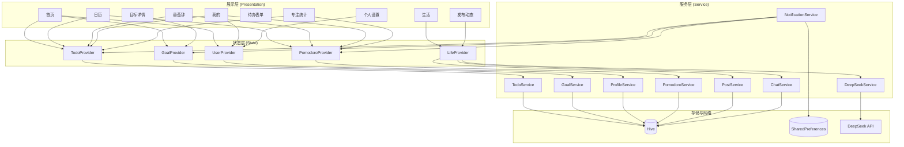

# 智能日常助手 APP — 全栈架构设计文档

> 移动开发技术课程 · 期末项目  
> Flutter 3.x + Provider + Hive + DeepSeek API

---

## 一、项目概述

APP 共 **13 个页面**，采用经典的分层架构设计。每一层的模块有单一明确的职责，层与层之间通过定义好的接口通信，不跨层调用。

---

## 二、整体分层架构

```
┌──────────────────────────────────────────────────────────────────┐
│                    1. Presentation Layer  (UI)                    │
│   pages/  13个页面 + 页面内组件                                   │
│   职责: 渲染UI、处理用户交互、订阅Provider数据                      │
│   不直接访问 Hive、不直接发 HTTP 请求                              │
├──────────────────────────────────────────────────────────────────┤
│                    2. State Management Layer                     │
│   providers/  6个 ChangeNotifier                                  │
│   职责: 持有应用状态、暴露数据给 UI、提供修改方法                   │
│   不引用任何 Widget、不持有 BuildContext                           │
├──────────────────────────────────────────────────────────────────┤
│                    3. Service Layer                               │
│   services/  接口调用 & 业务逻辑                                  │
│   职责: 封装 HTTP 请求、数据转换、本地存储读写                     │
│   被 Provider 调用，不直接与 UI 通信                               │
├──────────────────────────────────────────────────────────────────┤
│                    4. Data Layer                                  │
│   models/  数据模型定义                                           │
│   职责: 定义数据结构，提供序列化/反序列化                           │
│   纯 Dart 对象，不依赖任何框架                                     │
├──────────────────────────────────────────────────────────────────┤
│                    5. Storage & Network Layer                     │
│   Hive (本地DB)  +  DeepSeek API (远程)                           │
│   职责: 数据持久化存储 / 远程推理                                  │
└──────────────────────────────────────────────────────────────────┘
```

**调用规则**（严格单向，不可反向）：

```
Page  →  Provider  →  Service  →  Hive / HTTP
 ↓         ↓           ↓
Models   Models      Models
```

- Page 只能调用 Provider（`context.watch` / `context.read`）
- Provider 只能调用 Service（封装好的数据访问方法）
- Service 只能调用 Hive / HTTP
- 所有层共享 Model 定义，但 Model 不依赖任何层

---

## 三、Presentation Layer — 页面与组件

### 3.1 页面清单

APP 共 13 个页面，分为两个层级：

| 层级 | 页面 | 文件 | 核心职责 |
|------|------|------|---------|
| Tab (4) | 首页 HomePage | `pages/home/home_page.dart` | 今日看板：待办概览、番茄钟入口、目标网格 |
| Tab (4) | 日历 CalendarPage | `pages/calendar/calendar_page.dart` | 月视图 + 日期点击展开待办详情 |
| Tab (4) | 生活 LifePage | `pages/life/life_page.dart` | TabBar 切换动态/ AI 对话 |
| Tab (4) | 我的 ProfilePage | `pages/profile/profile_page.dart` | 个人中心、统计入口 |
| 子页面 (1) | 番茄钟 PomodoroPage | `pages/pomodoro/pomodoro_page.dart` | 倒计时、待办绑定、专注记录 |
| 子页面 (2) | 待办表单 TodoFormPage | `pages/calendar/todo_form_page.dart` | 新增待办 |
| 子页面 (3) | 待办详情 TodoDetailPage | `pages/calendar/todo_detail_page.dart` | 查看待办详情 |
| 子页面 (4) | 目标表单 GoalFormPage | `pages/calendar/goal_form_page.dart` | 新增目标 |
| 子页面 (5) | 目标详情 GoalDetailPage | `pages/calendar/goal_detail_page.dart` | 目标编辑、子目标管理 |
| 子页面 (6) | 发布动态 PostFormPage | `pages/life/post_form_page.dart` | 发布生活动态 |
| 子页面 (7) | 动态详情 PostDetailPage | `pages/life/post_detail_page.dart` | 查看动态详情 |
| 子页面 (8) | 个人信息编辑 ProfileEditPage | `pages/profile/profile_edit_page.dart` | 修改昵称/账号/签名 |
| 子页面 (9) | 专注统计 UsageStatsPage | `pages/profile/usage_stats_page.dart` | 数据可视化看板 |

每个页面内部不再拆独立组件文件，而是使用 build 方法中的内嵌 Widget 组合。

### 3.2 页面状态消费

每个页面通过 `context.watch<T>()` 订阅 Provider：

| 页面 | 订阅的 Provider | 用途 |
|------|----------------|------|
| HomePage | `TodoProvider`, `GoalProvider`, `UserProvider` | 待办列表、目标网格、打招呼昵称 |
| CalendarPage | `TodoProvider`, `PomodoroProvider` | 按日期筛选待办、当日专注时长 |
| PomodoroPage | `TodoProvider`, `PomodoroProvider` | 待办下拉绑定、记录写入 |
| GoalDetailPage | `GoalProvider` | 目标详情、子目标增删改 |
| ProfilePage | `TodoProvider`, `PomodoroProvider`, `UserProvider`, `ThemeProvider` | 统计卡片、深色模式 |
| UsageStatsPage | `TodoProvider`, `PomodoroProvider` | 环形成就图、柱状趋势 |
| ProfileEditPage | `UserProvider` | 编辑用户信息 |
| LifePage | `LifeProvider` | 动态时间线、AI 聊天记录 |

---

## 四、State Management Layer — 状态管理

### 4.1 六个 Provider

| Provider | 管理的状态 | 暴露的读取接口 | 暴露的修改接口 |
|----------|----------|-------------|-------------|
| `ThemeProvider` | `ThemeMode` | `themeMode`, `isDarkMode` | `toggleTheme()`, `setThemeMode()` |
| `TodoProvider` | `List<Todo>` | `todos`, `completedCount`, `todayCount`, `getTodosForDate(date)` | `toggleTodo(id)`, `addTodo(todo)`, `deleteTodo(id)` |
| `GoalProvider` | `List<Goal>` | `goals`, `getGoalById(id)` | `addGoal()`, `updateGoal()`, `toggleGoalStatus()`, `deleteGoal()`, `addSubGoal()`, `toggleSubGoal()`, `updateSubGoal()`, `deleteSubGoal()` |
| `UserProvider` | `UserProfile` | `profile` | `updateNickname()`, `updateAccount()`, `updateBio()`, `updateAvatar()` |
| `PomodoroProvider` | `List<PomodoroRecord>` | `records`, `totalRecords`, `todayRecords`, `todayMinutes`, `getRecordsForDate(date)`, `getMinutesPerDay(days)` | `addRecord(record)` |
| `LifeProvider` 🆕 | `List<Post>`, `ChatSession` | `posts`（按时间倒序）, `chatSession` | `addPost()`, `deletePost()`, `sendToAI()`, `replyToPost()` |

### 4.2 Provider 间调用关系

```
PomodoroPage._recordSession()
  → PomodoroProvider.addRecord()     // 写入专注记录
  → TodoProvider.toggleTodo()        // 若绑定待办则标记完成

LifeProvider.addPost(content, mood)
  → Hive 写入 Post（replies 初始为空）
  → DeepSeekService.chatText() 传文字 + 心情
  → AI 返回首条评论 → 写入 post.replies[0] → Hive 回写 → notifyListeners()

LifeProvider.replyToPost(postId, text)
  → 取 Post → post.replies.add(userMsg) → Hive 回写
  → 将 post.content + 全部 replies 发给 DeepSeekService.chatConversation()
  → AI 返回回复 → post.replies.add(aiMsg) → Hive 回写 → notifyListeners()

LifeProvider.sendToAI(text)
  → 取 ChatSession → session.messages.add(userMsg) → Hive 回写
  → 构建对话 history（最近 40 条含 system prompt）
  → DeepSeekService.chatConversation(history)
  → session.messages.add(aiMsg) → Hive 回写 → notifyListeners()
```

其余 Provider 之间不互相调用，保持独立。

### 4.3 注册位置

[main.dart](file:///d:/HarmonyOS/FlutterApplication/flutter_harmonyos/lib/main.dart) 第 16~23 行，`MultiProvider` 中一次性注册所有 Provider。

---

## 五、Service Layer — 接口与业务逻辑

### 5.1 层定位

Service 层是 Provider 和外部系统（Hive、HTTP）之间的桥梁。当前实现中业务逻辑直接写在 Provider 内部（Mock 数据），未来持久化时抽离为独立 Service 类。

**职责边界：**

- Service 层**封装** Hive 读写和 HTTP 请求
- Provider 层**不**直接操作 `Hive.box()` 或 `http.post()`
- 数据初始化：Provider 构造时调用 Service 读取 Hive，若无数据则降级使用 Mock

### 5.2 接口定义

#### 5.2.1 待办存储接口 `TodoService`

```
类名:        TodoService
职责:        封装 todos Hive Box 的读写

方法:
  List<Todo> loadAll()                     → 从 Hive 读取全部待办
  void saveAll(List<Todo> todos)           → 全量写入 Hive
  void saveOne(Todo todo)                  → 单条更新/插入

调用方:      TodoProvider (构造时 loadAll，修改后 saveAll)
```

不涉及网络请求，纯本地操作。

#### 5.2.2 目标存储接口 `GoalService`

```
类名:        GoalService
职责:        封装 goals Hive Box 的读写

方法:
  List<Goal> loadAll()                     → 从 Hive 读取全部目标
  void saveAll(List<Goal> goals)           → 全量写入 Hive

调用方:      GoalProvider (构造时 loadAll，修改后 saveAll)
```

#### 5.2.3 用户信息存储接口 `ProfileService`

```
类名:        ProfileService
职责:        封装 user_profile Hive Box 的读写

方法:
  UserProfile load()                       → 从 Hive 读取用户信息
  void save(UserProfile profile)           → 写入 Hive

调用方:      UserProvider (构造时 load，修改后 save)
```

#### 5.2.4 番茄钟记录存储接口 `PomodoroService`

```
类名:        PomodoroService
职责:        封装 pomodoro_records Hive Box 的读写

方法:
  List<PomodoroRecord> loadAll()                     → 读取全部记录
  void addRecord(PomodoroRecord record)              → 追加一条记录
  List<PomodoroRecord> getRecordsForDate(DateTime d) → 按日期筛选

调用方:      PomodoroProvider
```

#### 5.2.5 动态存储接口 `PostService`

```
类名:        PostService
职责:        封装 posts Hive Box 的读写

方法:
  List<Post> loadAll()                    → 从 Hive 读取全部动态
  void saveOne(Post post)                 → 单条插入/更新（发布时写入，AI 评论回写时更新）
  void deleteOne(String id)               → 删除一条动态

调用方:      LifeProvider
```

#### 5.2.6 聊天存储接口 `ChatService`

```
类名:        ChatService
职责:        封装 chat_sessions Hive Box 的读写（消息内嵌在 ChatSession 中）

方法:
  ChatSession loadSession()                                    → 读取对话（如无则返回默认空会话）
  void saveSession(ChatSession session)                        → 写入对话（含全部消息）

调用方:      LifeProvider
```

#### 5.2.7 AI 推理接口 `DeepSeekService`

```
类名:        DeepSeekService
职责:        封装 DeepSeek Chat Completion API 调用（纯文字对话）

方法:
  Future<String> chatText(String userMessage, {String? systemPrompt})
    → 单轮纯文字对话，返回 AI 回复（用于动态 AI 首评）

  Future<String> chatConversation(List<Map<String, String>> history)
    → 多轮对话，传入完整消息历史（含 system prompt），返回 AI 回复（用于 AI 聊天 + 动态下追问）

  Future<String> generateDailySummary(int completedCount, int totalCount,
                                       int focusMinutes, String nickname)
    → 根据当日数据生成智能小结（完成度 + 鼓励语）

  String detectEmotion(String text)
    → 本地规则引擎情绪识别（不调用 API）

调用方:      LifeProvider（动态 AI 评论 + AI 对话）
```

> 📌 **已删除** `chatWithImage` / `chatConversationWithImage` 方法——本项目 AI 回复仅基于文字内容和心情标签，不读取图片。

### 5.3 调用时序

以"用户点击完成一个待办"为例：

```
HomePage.onTap()
  │
  ▼
TodoProvider.toggleTodo(id)
  │ 1. 修改内存中的 _todos
  │ 2. 调用 TodoService.saveAll(_todos)   ← 持久化到 Hive
  │ 3. notifyListeners()                   ← 通知所有订阅者
  │
  ├──→ HomePage 重建 (context.watch) → 更新待办列表 UI
  ├──→ CalendarPage 重建              → 更新当日待办 UI
  └──→ ProfilePage 重建               → 更新今日完成数统计卡片
```

---

## 六、Data Layer — 数据模型

### 6.1 模型清单

| Model | 文件 | 字段数 | 职责 |
|-------|------|--------|------|
| `Todo` | `models/todo.dart:1-31` | 8 | 待办事项数据结构（含标题、优先级、完成状态、日期、时间）<br>⚠️ 后续需加 `tag` 字段以支持"分类时间占比饼图" |
| `Goal` | `models/goal.dart:17-40` | 9 | 长期目标（含子目标列表） |
| `SubGoal` | `models/goal.dart:1-15` | 5 | 短期子目标（内嵌于 Goal） |
| `UserProfile` | `models/user_profile.dart:1-13` | 4 | 用户个人信息 |
| `PomodoroRecord` | `models/pomodoro_record.dart:1-17` | 6 | 番茄钟专注记录 |
| `Post` 🆕 | `models/post.dart` | 8 | 生活动态（文字 + 心情 + AI 对话线程 + 图片展示）。`imageBase64` 仅用于动态卡片图片预览，不参与 AI 回复 |
| `ChatSession` 🆕 | `models/chat_session.dart` | 5 | 对话分组（标题 + 创建时间 + 内嵌消息列表） |

### 6.2 模型关系

```
Goal (1) ────< (N) SubGoal          // 组合关系，SubGoal 生命周期跟随 Goal

PomodoroRecord (N) ──> (0..1) Todo   // 可选关联，通过 todoId 绑定

ChatSession (1) ────< (N) ChatMessage  // 组合关系，ChatMessage 内嵌于 ChatSession.messages

Post (1) ────< (N) ChatMessage  // 组合关系，ChatMessage 内嵌于 Post.replies，AI 首评 + 多轮对话统一
```

### 6.3 配色常量

不在模型中定义，而是直接在页面代码中使用 Flutter 内置的 `Color(0xFFxxxxxx)` 常量。全局主题色在 `main.dart` 的 `_buildLightTheme()` / `_buildDarkTheme()` 中的 `ColorScheme` 定义。

---

## 七、Storage Layer — 本地持久化

### 7.1 整体存储架构（三层）

本项目采用**双数据库 + 文件系统**的三层存储策略，根据数据类型选择最合适的存储方式：

```
App 本地存储
│
├── Hive（结构化复杂数据，6 个 Box）
│   ├── Box 'todos'              —— 待办列表
│   ├── Box 'goals'              —— 目标列表（含子目标）
│   ├── Box 'user_profile'       —— 用户信息
│   ├── Box 'pomodoro_records'   —— 番茄钟记录
│   ├── Box 'posts'              —— 生活动态
│   └── Box 'chat_sessions'      —— AI 对话（含内嵌消息）
│
├── SharedPreferences（键值对 App 设置）
│   ├── 'theme_mode'         → bool   深色模式开关
│   ├── 'pomodoro_default'   → int    番茄钟默认分钟数
│   ├── 'day_summary'        → bool   每日小结通知开关
│   ├── 'todo_reminder'      → bool   待办提醒通知开关
│   └── 'goal_reminder'      → bool   目标截止提醒开关
│
└── 文件系统（大文件，如图片）
    └── /posts/{timestamp}.jpg       动态配图
```

**为什么不用单一存储**：

| 存储方式 | 适合什么 | 不适合什么 |
|---------|---------|-----------|
| Hive | 复杂的自定义对象列表（Todo、Goal、Post），需要 TypeAdapter 序列化 | 单个 bool/int 值——杀鸡用牛刀 |
| SharedPreferences | 零散的键值对设置（主题、默认值、开关） | 存复杂对象需要手动 JSON 转换，不如 Hive 方便 |
| 文件系统 | 图片、视频等大文件 | 结构化数据无法直接查询 |

### 7.2 Hive 选型理由

选择 **Hive**（纯 Dart 键值对数据库），对比 SQLite：

| 维度 | Hive | SQLite (`sqflite`) |
|------|------|-------------------|
| 实现方式 | 纯 Dart，零原生依赖 | 原生插件，依赖 Android/iOS SQLite 引擎 |
| 开发体验 | `box.put(key, value)` 一行读写 | 需写建表 DDL + SQL 语句 |
| 查询方式 | Dart `where()`/`fold()` 内存筛选 | SQL `SELECT...WHERE...GROUP BY` |
| 数据量适配 | < 1000 条时性能远超 SQLite | 数据量上万且有 JOIN 需求时才显出优势 |
| 字段变更 | 改 Model 类即可，自动兼容旧数据 | 需写 `ALTER TABLE` + `onUpgrade` 迁移逻辑 |
| 调试 | `box.values.toList()` 直接打印 | 需 `adb pull` 导出 .db 用 DB Browser 查看 |

**选择 Hive 的理由**：本项目数据量极小（单用户，至多数百条记录），无复杂 JOIN/GROUP BY 需求，且开发期间 Model 字段频繁变更——Hive 的零迁移成本是最大优势。

### 7.3 Hive Box 整体结构

```
Hive (应用本地存储)
│
├── Box 'todos'              —— 待办列表，泛型 Box<Todo>
├── Box 'goals'              —— 目标列表（含内嵌子目标），泛型 Box<Goal>
├── Box 'user_profile'       —— 用户信息（单条），不设泛型
├── Box 'pomodoro_records'   —— 番茄钟记录列表，泛型 Box<PomodoroRecord>
├── Box 'posts' 🆕            —— 生活动态列表，泛型 Box<Post>
└── Box 'chat_sessions' 🆕    —— AI 对话（含内嵌消息），泛型 Box<ChatSession>
```

六个 Box 之间不设外键——关联通过 Model 字段中的 ID 实现（如 `PomodoroRecord.todoId` 指向 `Todo.id`），这是键值对数据库的标准做法。

### 7.4 Box 1: `todos` — 待办事项

**类型**：`Box<Todo>`

**数据示例**：

```json
{
  "id": "1716123456789",
  "title": "复习高数第三章",
  "description": "重点看微分中值定理和导数应用",
  "priority": 3,
  "done": false,
  "date": "2026-05-20",
  "time": "18:00"
}
```

| 字段 | 类型 | 说明 |
|------|------|------|
| id | String | 主键，`DateTime.now().millisecondsSinceEpoch.toString()` 生成 |
| title | String | 待办标题 |
| description | String | 详细描述 |
| priority | int | 3=高(红) 2=中(黄) 1=低(绿) |
| done | bool | 是否已完成 |
| date | DateTime | 关联到具体日期，用于日历视图按日筛选 |
| time | TimeOfDay? | 提醒时间，可为空 |

**CRUD 操作**：

```dart
final box = Hive.box<Todo>('todos');

// 读全部
List<Todo> all = box.values.toList();

// 按日期筛选（内存中 Dart 原生筛选，不走磁盘）
List<Todo> today = box.values.where((t) => t.date == DateTime.now()).toList();

// 写入（有则更新，无则插入）
box.put(todo.id, todo);

// 删除
box.delete(todo.id);
```

### 7.5 Box 2: `goals` — 目标列表（含内嵌子目标）

**类型**：`Box<Goal>`

**数据示例**：

```json
{
  "id": "g1",
  "title": "考研上岸",
  "description": "目标院校：华南理工大学",
  "progress": 0.50,
  "remainingDays": 120,
  "deadline": "2026-09-01",
  "iconName": "school",
  "status": "进行中",
  "subGoals": [
    { "id": "sg1", "goalId": "g1", "title": "完成高数一轮复习", "isCompleted": true, "deadline": "2026-03-01" },
    { "id": "sg2", "goalId": "g1", "title": "英语单词背完一轮", "isCompleted": false, "deadline": "2026-04-01" }
  ]
}
```

| 字段 | 类型 | 说明 |
|------|------|------|
| id | String | 主键 |
| title | String | 目标名称 |
| description | String | 目标描述 |
| progress | double | 0.0~1.0，由子目标完成数自动计算 |
| remainingDays | int | 截止日期 − 今天，动态计算 |
| deadline | DateTime | 截止日期 |
| status | String | "进行中" / "已完成" |
| subGoals | List\<SubGoal\> | 内嵌子目标列表 |

**设计决策：SubGoal 内嵌 vs 独立 Box**

- 内嵌：子目标生命周期完全跟随父目标（删目标则子目标一起删除），子目标完成数直接驱动父目标的 `progress` 字段计算
- 如果拆成两个独立 Box，需要手动维护 `goalId` 外键关联、级联删除逻辑、跨 Box 计算 progress——对 < 10 个目标、< 50 个子目标的数据量来说完全过度设计

### 7.6 Box 3: `user_profile` — 用户个人信息（单条）

**类型**：不设泛型，直接用 `Box`（键值对模式）

**数据示例**：

```json
{
  "nickname": "小明",
  "account": "student@example.com",
  "bio": "用更好的自己迎接每一天 ✨",
  "avatarBase64": null
}
```

| 字段 | 类型 | 说明 |
|------|------|------|
| nickname | String | 用户昵称，首页打招呼区域使用 |
| account | String | 账号 |
| bio | String | 个人签名 |
| avatarBase64 | String? | 头像 Base64 编码，可为空 |

**读写方式**（单条数据，不走列表）：

```dart
final box = Hive.box('user_profile');

// 读
final nickname = box.get('nickname', defaultValue: '同学');

// 写
box.put('nickname', '小明');
```

**为什么这个 Box 不用泛型**：永远只有一条记录，键值对模式 (`box.get('key')`) 比 `Box<UserProfile>` + `box.values.first` 更直接。

### 7.7 Box 4: `pomodoro_records` — 番茄钟专注记录

**类型**：`Box<PomodoroRecord>`

**数据示例**：

```json
{
  "id": "pr1",
  "date": "2026-05-20",
  "durationMinutes": 25,
  "todoId": "3",
  "todoTitle": "运动30分钟",
  "completedAt": "2026-05-20T15:30:00"
}
```

| 字段 | 类型 | 说明 |
|------|------|------|
| id | String | 主键 |
| date | DateTime | 记录日期，用于日历/统计按日聚合 |
| durationMinutes | int | 本次专注时长(分钟) |
| todoId | String? | 绑定的待办 ID，可为空（不绑定的番茄钟） |
| todoTitle | String? | 绑定的待办标题，避免查询时二次查 Todo |
| completedAt | DateTime | 完成时间戳 |

**统计查询示例**：

```dart
final box = Hive.box<PomodoroRecord>('pomodoro_records');

// 今日专注总分钟
box.values
    .where((r) => r.date == DateTime.now())
    .fold(0, (sum, r) => sum + r.durationMinutes);

// 近7天每日分钟数（供柱状图使用）
for (int i = 6; i >= 0; i--) {
  final date = DateTime.now().subtract(Duration(days: i));
  result['${date.month}/${date.day}'] = box.values
      .where((r) => r.date == date)
      .fold(0, (sum, r) => sum + r.durationMinutes);
}
```

### 7.8 Box 5: `posts` — 生活动态

**类型**：`Box<Post>`

**Post 字段设计**：

| 字段 | 类型 | 说明 |
|------|------|------|
| id | String | 主键 |
| content | String | 用户写的文字 |
| moodEmoji | String | 😊😐😰😫😢 之一 |
| moodLabel | String | 开心/平静/焦虑/疲惫/难过 |
| imageBase64 | String? | 图片 base64 编码 (256×256 裁剪后约 10-20KB)，仅用于动态卡片展示预览，不参与 AI 回复 |
| replies | List\<ChatMessage\> | **AI 对话线程**。第 1 条为 AI 首评（基于文字+心情），后续为用户追问+AI 回复 |
| createdAt | DateTime | 发布时间 |

**数据示例**：

```json
{
  "id": "1716123456789",
  "content": "今天图书馆学了6小时，感觉很充实！",
  "moodEmoji": "😊",
  "moodLabel": "开心",
  "imageBase64": "/9j/4AAQSkZJRg...",
  "replies": [
    {"role": "ai", "content": "图书馆6小时超棒的！坚持就是胜利 💪", "timestamp": "2026-05-20T16:30:05"},
    {"role": "user", "content": "能给我一些学习建议吗", "timestamp": "2026-05-20T16:31:00"},
    {"role": "ai", "content": "建议用番茄钟法，25分钟专注+5分钟休息，效率会更高！", "timestamp": "2026-05-20T16:31:08"}
  ],
  "createdAt": "2026-05-20T16:30:00"
}
```

**发布流程**：

1. 用户输入文字 + 选图片 (可选) + 选心情 → 点发布
2. 创建 Post 对象（imageBase64 + replies 为空）→ Hive 持久化 → UI 先显示动态卡片
3. 图片用 `Image.memory(base64Decode(post.imageBase64!))` 渲染
4. 调 DeepSeek `chatText(content, systemPrompt)` 基于文字+心情生成 AI 首评
5. AI 返回 → `post.replies.add(ChatMessage(role:'ai', content:result))` → Hive 回写 → UI 更新

**动态下 AI 对话（replyToPost）**：

- 用户在动态卡片下方的输入框输入追问
- `replyToPost(postId, text)` 将 `post.content` + 全部 `replies` 构建 history 发给 DeepSeek
- AI 保持对原始文字内容的记忆，回复基于完整上下文

**动态删除**：

- 每条动态卡片右上角有删除按钮（× 图标）
- 点击 → 确认弹窗 "确定删除这条动态？"
- 确认 → `LifeProvider.deletePost(id)` → Hive 删除 → UI 刷新

### 7.8.1 PostFormPage UI 设计

**页面布局**：

```
[PostFormPage]
│
├── AppBar: "发布动态" + 右侧 "发布" 按钮
│     → 发布按钮: 文字非空 OR 图片已选时可用 (橙色), 均空时灰色禁用
│
├── "今天的心情怎么样？" 标题
├── 心情选择行：😊 开心 | 😐 平静 | 😰 焦虑 | 😫 疲惫 | 😢 难过
│     → 点击选中, 橙色高亮边框 + 浅橙色背景
│
├── 文字输入框 (TextField, maxLines: 8)
│     → hint: "分享你的想法..."
│     → onChanged: 更新发布按钮可用状态
│
└── 图片选取区域：
      │
      ├── "添加图片" 标题行 + 右侧 "删除" 按钮 (选图后显示)
      │
      └── 正方形预览区 (边长 = 屏幕宽度 − 32px)
            │
            ├── 未选择时：
            │     Container 白色/浅灰背景, 边框虚线/实线
            │     内容: 📷 icon (48px) + 文字 "点击拍照或从相册选择"
            │     不可点击 → 点击弹出功能按钮
            │
            ├── 点击后 → showModalBottomSheet:
            │     ├── 📸 拍照 → image_picker ImageSource.camera
            │     └── 🖼️ 从相册选择 → image_picker ImageSource.gallery
            │
            ├── 选择后：
            │     → maxWidth: 512, maxHeight: 512 自动裁剪为 1:1 正方形
            │     → 图片转 Uint8List bytes → Image.memory() 填满正方形预览框
            │     → 发布按钮变为可用 (即使没有文字)
            │     → "删除" 按钮出现, 点击恢复占位状态
            │
            └── 发布时：
                  → 按钮变为 CircularProgressIndicator + "发布中..."
                  → 图片 base64 编码 → LifeProvider.addPost(base64Image: ...)
                  → 成功 Navigator.pop + SnackBar "动态已发布"
                  → 失败 SnackBar 红色提示
```

**图片选取流程（代码实现规范）**：

```dart
// _pickImage() 方法
final source = await showModalBottomSheet<ImageSource>(...);  // 弹出 拍照/相册 选项
if (source == null) return;

final xFile = await ImagePicker().pickImage(
  source: source,
  maxWidth: 512,     // 1:1 裁剪
  maxHeight: 512,
);
final bytes = await xFile.readAsBytes();  // 跨平台通用 (XFile, 无需 dart:io)
setState(() { _selectedBytes = bytes; }); // 内存中存储, Image.memory() 渲染
```

**发布逻辑**：

```dart
// _publish() 方法
final content = _contentController.text.trim();
if (content.isEmpty && _selectedBytes == null) {
  // 两者都空 → SnackBar 提示
  return;
}

setState(() => _isUploading = true);  // 显示进度

String? base64Image = _selectedBytes != null ? base64Encode(_selectedBytes!) : null;

await LifeProvider.addPost(content, moodEmoji, moodLabel, base64Image: base64Image);

Navigator.pop(context);
```

**AI 策略说明**：
- 图片存入 `Post.imageBase64` 仅用于 **动态卡片预览展示**
- `LifeProvider.addPost()` 调 AI 时**仅传文字+心情** (`chatText`)，不传图片
- 动态下追问同样基于纯文字上下文
- 图片是**展示层**功能，不影响 AI 回复逻辑

**依赖**: `image_picker: ^1.1.2`


### 7.8.2 动态卡片 UI 设计（_FeedTab）

**卡片结构**：

```
[Card] ──────────────────────────────────────────
│  😊 [开心]              今天 16:30    [×]    │  ← × 删除按钮 (红色, 右上角)
│                                                 │
│  今天图书馆学了6小时，感觉很充实！              │  ← 文字内容
│  ─────────────────────────────────────────      │
│  🤖 图书馆6小时超棒的！坚持就是胜利 💪          │  ← AI 首评 (蓝色气泡)
│  ─────────────────────────────────────────      │
│  👤 能给我一些学习建议吗                        │  ← 用户追问
│  🤖 建议用番茄钟法...                          │  ← AI 回复
│                                                 │
│  [________________和AI聊聊这条动态...___] [➤]   │  ← 追问输入框 + 发送按钮
└─────────────────────────────────────────────────┘
```

**删除交互**：

- 点击 × → `showDialog` 确认弹窗 "确定要删除这条动态吗？"
- 确认 → `context.read<LifeProvider>().deletePost(post.id)`
- 取消 → 关闭弹窗

### 7.8.3 _AIChatTab UI 设计

```
[_AIChatTab]
│
├── 对话气泡列表 (ListView)
│     🤖 你好呀！我是你的AI陪伴助手...
│     👤 今天复习了一天好累
│     🤖 辛苦啦！...
│
└── 底部输入栏 (Container, 顶圆角 + 阴影)
      [___________说点什么...____________] [发送]
                                            ↑ 文字按钮 "发送"
                                            ↑ color: 主题色 #F98C53
```

**变更说明**：

- 发送按钮从圆圈箭头图标 → 文字按钮 "发送"
- 输入框 + "发送"在同一行，右侧文字按钮

### 7.8.4 LifePage FAB 设计变更

```
变更前: FAB 在 LifePage 层级，两个 Tab 都显示 (右下角 + 号)
变更后: FAB 移到 _FeedTab 内部，仅在动态 Tab 显示
        AI 小助手 Tab 不显示发布按钮
```

实现方式：

- 删除 `LifePage` 的 `floatingActionButton`
- 在 `_FeedTab` 内通过 `Stack` + `Positioned` 放置 FAB


### 7.9 Box 6: `chat_sessions` — AI 对话

**类型**：`Box<ChatSession>`，存储单个对话（本 App 仅保留一个常驻对话）。

**ChatSession 数据示例**：

```json
{
  "id": "default",
  "title": "AI小助手",
  "createdAt": "2026-05-20T14:00:00",
  "messages": [
    {"role": "ai", "content": "你好呀！我是你的AI陪伴助手，有什么想聊的吗？�", "imagePath": null, "timestamp": "2026-05-20T14:00:00"},
    {"role": "user", "content": "今天复习了一天好累", "imagePath": null, "timestamp": "2026-05-20T14:01:00"},
    {"role": "ai", "content": "辛苦啦！充实的疲惫最值得💪", "imagePath": null, "timestamp": "2026-05-20T14:01:08"}
  ]
}
```

| 字段 | 类型 | 说明 |
|------|------|------|
| id | String | 固定为 `default` |
| title | String | 固定为 `AI小助手` |
| createdAt | DateTime | 创建时间 |
| messages | List\<ChatMessage\> | 内嵌消息列表 |

**ChatMessage（内嵌于 ChatSession，不是独立 Model 文件）**：

| 字段 | 类型 | 说明 |
|------|------|------|
| role | String | `user` / `ai` |
| content | String | 消息正文 |
| imagePath | String? | 用户发的图片文件名（本 App 未启用） |
| timestamp | DateTime | 发送时间 |

**设计决策：单会话模式**

- 本 App 仅保留一个 AI 陪伴对话窗口，用户无需手动管理会话列表
- 消息历史持续累加，发送时取最近 40 条带 system prompt 构建完整上下文发给 DeepSeek
- 删除了原来多会话管理功能（createSession / switchSession / deleteSession），降低 UI 复杂度

**CRUD 操作**：

```dart
final box = Hive.box('chat_sessions');

// 发送消息
final chatSession = LifeProvider().chatSession;
chatSession.messages.add(ChatMessage(role: 'user', content: text));
box.put('data', jsonEncode(chatSession.toJson()));

// 构建对话上下文（取最近 40 条发给 DeepSeek）
final recentMessages = chatSession.messages.length > 40
    ? chatSession.messages.sublist(chatSession.messages.length - 40)
    : chatSession.messages;
final history = <Map<String, String>>[];
history.add({'role': 'system', 'content': '你是一个温暖的AI陪伴助手...'});
for (final msg in recentMessages) {
  history.add({'role': msg.role, 'content': msg.content});
}
```

### 7.10 TypeAdapter 注册

Hive 需要为每种自定义类型生成序列化器。每个 Model 类通过 `@HiveType` / `@HiveField` 注解标记，运行 `flutter packages pub run build_runner build` 自动生成 Adapter：

```
Todo           → TodoAdapter
Goal           → GoalAdapter
SubGoal        → SubGoalAdapter
UserProfile    → UserProfileAdapter
PomodoroRecord → PomodoroRecordAdapter
Post 🆕         → PostAdapter
ChatSession 🆕  → ChatSessionAdapter
```

启动时注册：

```dart
Hive.registerAdapter(TodoAdapter());
Hive.registerAdapter(GoalAdapter());
Hive.registerAdapter(SubGoalAdapter());
Hive.registerAdapter(UserProfileAdapter());
Hive.registerAdapter(PomodoroRecordAdapter());
```

### 7.11 完整初始化与关闭流程

```dart
void main() async {
  WidgetsFlutterBinding.ensureInitialized();

  // 1. 初始化 Hive 引擎
  await Hive.initFlutter();

  // 2. 注册 TypeAdapter（7 个）
  Hive.registerAdapter(TodoAdapter());
  Hive.registerAdapter(GoalAdapter());
  Hive.registerAdapter(SubGoalAdapter());
  Hive.registerAdapter(UserProfileAdapter());
  Hive.registerAdapter(PomodoroRecordAdapter());
  Hive.registerAdapter(PostAdapter());
  Hive.registerAdapter(ChatSessionAdapter());

  // 3. 打开 Box（6 个）
  await Hive.openBox<Todo>('todos');
  await Hive.openBox<Goal>('goals');
  await Hive.openBox('user_profile');
  await Hive.openBox<PomodoroRecord>('pomodoro_records');
  await Hive.openBox<Post>('posts');
  await Hive.openBox<ChatSession>('chat_sessions');

  // 4. 启动 App → Provider 构造时从 Box 读数据
  runApp(MyApp());
}
```

### 7.12 数据流：从 Hive 到 UI 的完整链路（以 Life 模块为例）

```
App 启动
  │
  ├── Hive.openBox<Post>('posts')          → 从磁盘加载历史动态
  ├── Hive.openBox<ChatSession>('chat_sessions') → 加载对话（含内嵌消息）
  │
  ├── LifeProvider()
  │     constructor: _posts = postBox.values.toList()
  │                   _chatSession = 从 Hive 读或初始化默认会话
  │
  ├── LifePage (动态 Tab)
  │     context.watch<LifeProvider>().posts
  │     → 按时间倒序展示动态卡片（文字 + AI 对话线程）
  │     → 每条动态右上角 × 删除按钮
  │     → 每条动态下方展示 replies 对话气泡 + 输入框
  │
  │  用户发布新动态
  │     → LifeProvider.addPost(content, mood)
  │        → Hive 写入 Post（replies 为空）
  │        → DeepSeekService.chatText(content, systemPrompt)
  │        → AI 返回首评 → post.replies.add(aiMsg) → Hive 回写
  │        → notifyListeners()
  │        └── LifePage 重建 → 新动态出现 + AI 首评显示
  │
  │  用户在动态下追问
  │     → LifeProvider.replyToPost(postId, text)
  │        → post.replies.add(userMsg)
  │        → 构建 history：system prompt + post.content + post.replies 全部历史
  │        → DeepSeekService.chatConversation(history)
  │        → post.replies.add(aiMsg) → Hive 回写
  │        → notifyListeners()
  │        └── 动态卡片下对话气泡更新
  │
  │  用户删除动态
  │     → LifeProvider.deletePost(postId)
  │        → Hive 删除 → notifyListeners()
  │        └── 动态卡片从列表中移除
  │
  ├── LifePage (AI 聊天 Tab)
  │     context.watch<LifeProvider>().chatSession
  │     → session.messages 直接渲染对话气泡
  │
  │  用户发消息
  │     → LifeProvider.sendToAI(text)
  │        → chatSession.messages.add(userMsg)
  │        → Hive 回写
  │        → 取 chatSession.messages 最近 40 条构建 history
  │        → DeepSeekService.chatConversation(history)
  │        → chatSession.messages.add(aiMsg)
  │        → Hive 回写
  │        → notifyListeners()
  │        └── LifePage 重建 → 新气泡出现在对话底部
```

### 7.13 SharedPreferences — App 设置存储

与 Hive 不同，`shared_preferences` 专门存储零散键值对，适合存一个 `bool` 或一个 `int`：

| Key | 类型 | 默认值 | 说明 |
|-----|------|--------|------|
| `theme_mode` | bool | `false` (浅色) | 深色模式开关状态 |
| `pomodoro_default` | int | `25` | 番茄钟默认分钟数，首页快捷入口使用 |
| `day_summary` | bool | `true` | 每日小结通知开关 |
| `todo_reminder` | bool | `true` | 待办当日 20:00 提醒开关 |
| `goal_reminder` | bool | `true` | 目标/子目标截止前 3 天提醒开关 |

**读写方式**（比 Hive 更简单，不需要 TypeAdapter）：

```dart
final prefs = await SharedPreferences.getInstance();

// 读（带默认值，首次安装时使用）
final isDark = prefs.getBool('theme_mode') ?? false;
final pomodoroDefault = prefs.getInt('pomodoro_default') ?? 25;

// 写（一行完成，自动持久化）
prefs.setBool('theme_mode', true);
prefs.setInt('pomodoro_default', 30);
```

**与 ThemeProvider 的集成**：

```dart
class ThemeProvider extends ChangeNotifier {
  ThemeMode _themeMode = ThemeMode.light;

  ThemeProvider() {
    _loadFromPrefs();  // 构造时从 SharedPreferences 恢复上次的主题设置
  }

  Future<void> _loadFromPrefs() async {
    final prefs = await SharedPreferences.getInstance();
    _themeMode = (prefs.getBool('theme_mode') ?? false)
        ? ThemeMode.dark : ThemeMode.light;
    notifyListeners();
  }

  void toggleTheme() {
    _themeMode = _themeMode == ThemeMode.light ? ThemeMode.dark : ThemeMode.light;
    SharedPreferences.getInstance()
        .then((p) => p.setBool('theme_mode', _themeMode == ThemeMode.dark));
    notifyListeners();
  }
}
```

**与首页番茄钟默认时长的集成**：

```dart
// 首页的快速开始按钮
void _startPomodoro() async {
  final prefs = await SharedPreferences.getInstance();
  final defaultMinutes = prefs.getInt('pomodoro_default') ?? 25;
  Navigator.pushNamed(context, AppRoutes.pomodoro, arguments: defaultMinutes);
}
```

**依赖**：`shared_preferences: ^2.x`（Flutter 官方包，已在 pubspec.yaml 中预留）。

---

## 八、Local Notification — 本地通知

### 8.1 技术选型

使用 `flutter_local_notifications` 插件，支持 Android/iOS 双平台，无需后台服务。

### 8.2 通知触发规则总览

本 App 的本地通知分为两类：**定时通知**（固定时间触发）和**条件通知**（满足条件时触发）。

| 序号 | 通知类型 | 触发条件 | 触发时间 | 通知内容 |
|------|---------|---------|---------|---------|
| ① | 待办提醒 | 当天有待办日程 | 当日 20:00 | "📋 今日待办提醒：你还有 N 项待办未完成，加油！" |
| ② | 子目标截止提醒 | 子目标 deadline − 今天 = 3 天 | 当天 09:00 | "⏰ 短期目标「{title}」还有 3 天截止" |
| ③ | 目标截止提醒 | 目标 deadline − 今天 = 3 天 | 当天 09:00 | "🎯 目标「{title}」还有 3 天截止，进度 {progress}%" |
| ④ | 每日小结 | 每天固定 | 每天 21:00 | "🌟 今日小结：完成了 N 个待办，专注了 M 分钟。{一句鼓励}" |
| ⑤ | 连续专注鼓励 | 连续 3/7 天有番茄钟记录 | 第 3/7 天 21:30 | "🔥 你已经连续 X 天专注！这是你坚持的证据，继续保持！" |
| ⑥ | 番茄钟完成 | 番茄钟倒计时归零 | 即时（倒计时结束时） | "🎉 专注完成！完成了 X 分钟的专注" |
| ⑦ | 新动态 AI 评论就绪 | 发布动态后 AI 评论生成完毕 | 即时（API 回调时） | "🤖 AI 已为你的动态生成了评论，快来看看吧～" |

**用户可在"我的 → 通知设置"中通过 SharedPreferences 按键关闭 ①②③④ 的通知。**

### 8.3 通知初始化

```dart
// main.dart 中
final flutterLocalNotificationsPlugin = FlutterLocalNotificationsPlugin();

const initializationSettingsAndroid =
    AndroidInitializationSettings('@mipmap/ic_launcher');
const initializationSettings = InitializationSettings(
  android: initializationSettingsAndroid,
);
await flutterLocalNotificationsPlugin.initialize(initializationSettings);
```

### 8.4 ① 待办 20:00 提醒设计

这是 App 中最重要的通知之一。核心逻辑：每天 20:00 检查当日是否有未完成的待办，有则推送。

```
触发逻辑（每次 App 启动或每天后台检查时执行）：
  │
  ├── 1. 读取 SharedPreferences: todo_reminder == true？
  │     └── 否 → 跳过，不推送
  │
  ├── 2. 从 Hive.box<Todo>('todos') 筛选：
  │     todayTodos = todos.where(t.date == today && !t.done)
  │
  ├── 3. 若 todayTodos.isNotEmpty:
  │     title: '📋 今日待办提醒'
  │     body: '你还有 ${todayTodos.length} 项待办未完成，加油！'
  │     调度时间: 今日 20:00
  │
  └── 4. 使用 flutter_local_notifications 的 zonedSchedule() 定时
```

**注意**：Android 需要 `AndroidManifest.xml` 中声明 `RECEIVE_BOOT_COMPLETED` 权限，并在 App 启动时重新注册定时通知（系统重启后定时器会丢失）。

### 8.5 ②③ 目标截止前 3 天提醒

```
触发逻辑：
  │
  ├── 1. 读取 SharedPreferences: goal_reminder == true？
  │     └── 否 → 跳过
  │
  ├── 2. 遍历 Hive.box<Goal>('goals'):
  │     ├── 对每个 Goal：
  │     │   daysLeft = deadline.difference(today).inDays
  │     │   若 daysLeft == 3 && status == '进行中':
  │     │     → 推送: "🎯 目标「{title}」还有 3 天截止，进度 {progress}%"
  │     │
  │     └── 对每个 SubGoal：
  │           daysLeft = deadline.difference(today).inDays
  │           若 daysLeft == 3 && !isCompleted:
  │             → 推送: "⏰ 短期目标「{title}」还有 3 天截止"
  │
  └── 调度时间: 当天 09:00
```

### 8.6 ④ 每日小结通知

每天 21:00 自动推送，汇总今日数据：

```
触发逻辑（每天 21:00）：
  │
  ├── 1. 读取 SharedPreferences: day_summary == true？
  │
  ├── 2. 统计今日数据：
  │     今日完成待办 = TodoProvider.completedCount
  │     今日总待办 = TodoProvider.todayCount
  │     今日专注分钟 = PomodoroProvider.todayMinutes
  │
  ├── 3. 根据完成率生成鼓励语：
  │     ≥80%: '今天表现超棒！明天继续保持 🚀'
  │     50~79%: '不错的一天，明天再努力一点点 ✨'
  │     <50%: '今天辛苦啦，好好休息，明天重新出发 💪'
  │
  └── 4. 推送通知:
       title: '🌟 每日小结'
       body: '完成了 ${completed}/${total} 个待办，专注了 ${minutes} 分钟。${鼓励语}'
```

### 8.7 ⑤ 连续专注鼓励

```
触发逻辑（每天 21:30 检查）：
  │
  ├── 1. 遍历 PomodoroProvider.getMinutesPerDay(7):
  │     统计连续 > 0 分钟的天数
  │
  ├── 2. 若连续天数 == 3 或 7:
  │     → title: '🔥 连续专注'
  │     → body: '你已经连续 ${days} 天专注！这是你坚持的证据，继续保持！'
  │
  └── 若当天无连续（天数不满足 3 或 7）→ 不推送
```

### 8.8 ⑥⑦ 即时通知

**番茄钟完成**（倒计时归零时即时触发，不需要定时器）：

```dart
// PomodoroPage._onComplete() 中
flutterLocalNotificationsPlugin.show(
  0, '🎉 专注完成！', '完成了 ${minutes} 分钟的专注',
  NotificationDetails(android: AndroidNotificationDetails(...)),
);
```

> 注：即时通知不需要在 SharedPreferences 中设置开关——用户正在使用番茄钟时自然需要感知结束。

**AI 首评就绪**（LifeProvider.addPost() 中 DeepSeek 回调完成后）：

```dart
// LifeProvider.addPost() 中，API 回调后
post.replies.add(ChatMessage(role: 'ai', content: aiResult));
box.put('data', jsonEncode(_posts.map((p) => p.toJson()).toList()));
notifyListeners();

// 推送通知
flutterLocalNotificationsPlugin.show(
  1, '🤖 AI 评论就绪', 'AI 已为你的动态生成了评论，快来看看吧～',
  NotificationDetails(...),
);
```

### 8.9 依赖

| 包 | 版本 | 用途 |
|----|------|------|
| `flutter_local_notifications` | ^18.x | 本地通知推送 |
| `shared_preferences` | ^2.x | 存储通知开关 + App 设置 |
| `android_alarm_manager_plus` | ^4.x | Android 后台定时任务（可选，用于重启后恢复通知） |

---

## 九、Network Layer — HTTP 请求

### 9.1 DeepSeek API（文字对话 + 图片多模态）

**端点**：`POST https://api.deepseek.com/v1/chat/completions`

**认证**：`Authorization: Bearer <API_KEY>`

**通用参数**：

| 参数 | 类型 | 必填 | 说明 |
|------|------|------|------|
| model | string | 是 | `deepseek-chat` |
| temperature | number | 否 | 0~2，控制随机性 |
| max_tokens | number | 否 | 最大生成长度 |

#### 场景一：纯文字对话

```json
{
  "model": "deepseek-chat",
  "messages": [
    {"role": "system", "content": "你是温暖的大学生陪伴助手"},
    {"role": "user", "content": "今天复习了一天好累"}
  ],
  "temperature": 0.8,
  "max_tokens": 200
}
```

**响应**：`{"choices":[{"message":{"role":"assistant","content":"辛苦啦！充实的疲惫是最值得的💪 今晚好好休息"}}]}`

#### 场景二：识别 + 评价图片内容

```json
{
  "model": "deepseek-chat",
  "messages": [
    {
      "role": "user",
      "content": [
        {"type": "text", "text": "根据这张图，帮我写一句温暖评价"},
        {"type": "image_url", "image_url": {"url": "data:image/jpeg;base64,/9j/..."}}
      ]
    }
  ]
}
```

**适用场景**：
- 用户在生活圈发动态（文字 + 自拍/书桌/打卡照），AI 自动生成共情评论
- 用户在 AI 对话中上传图片，AI 识别内容并给出鼓励式评价

#### 场景三：智能小结生成

**输入**：当日待办完成数、专注分钟数、用户昵称

```json
{
  "model": "deepseek-chat",
  "messages": [
    {"role": "system", "content": "你是数据驱动的每日小结生成器。根据用户今天的完成数据，生成一段60字以内的鼓励小结。"},
    {"role": "user", "content": "今日完成: 3个待办 / 共5个待办 (60%)。今日专注: 75分钟。昵称: 小明"}
  ]
}
```

**响应示例**：

> "小明，今天完成了60%的计划，专注了75分钟✨已经很不错了！明天继续保持这个节奏，每一步都在靠近你的目标🎯"

#### 错误处理策略

| 错误类型 | 处理方式 |
|---------|---------|
| 网络超时 (10s) | 返回预设友好文字："网络有点慢，我依然在这里陪你 🤗" |
| API 返回错误码 | 降级为本地规则引擎生成回复 |
| 图片过大 (>20MB) | 前端先压缩再上传 |

### 9.2 无其他网络请求

待办、目标、用户信息、专注记录均为本地数据，不涉及服务端同步。这是单机 App，数据完全私有。

---

## 十、Route Layer — 路由管理

### 9.1 文件拆分

| 文件 | 职责 |
|------|------|
| `routes/app_routes.dart` | 定义 9 条路由常量，避免字符串硬编码 |
| `routes/app_router.dart` | `generateRoute()` 方法：switch-case 解包 `arguments`、创建页面、default 兜底 |
| `main.dart` | `onGenerateRoute: AppRouter.generateRoute` 一行注册 |

### 9.2 路由参数传递规格

| 路由 | arguments 类型 | 示例 |
|------|---------------|------|
| `/pomodoro` | `int?` | `25` |
| `/todoForm` | `Map<String, dynamic>?` | `{'date': DateTime(2026,5,20)}` |
| `/todoDetail` | `String?` | `'1'` |
| `/goalDetail` | `String?` | `'g1'` |
| `/postDetail` | `Map<String, dynamic>?` | `{'id':'p1','content':'...'}` |
| 其余路由 | 无 | — |

---

## 十一、完整数据流总图



---

## 十二、端到端数据流示例

### 示例 1：首页点击完成待办

```
[首页] 用户点击待办项的圆形图标
   → context.read<TodoProvider>().toggleTodo('1')
      → TodoProvider: 翻转 _todos[0].done = true
      → TodoProvider: notifyListeners()
         ├── [首页] context.watch 重建 → 待办文字加删除线、进度条更新
         ├── [日历] context.watch 重建 → 当日完成率刷新
         └── [我的] context.watch 重建 → "今日完成"统计数 +1

    未来: → TodoService.saveAll(_todos)  ← 写入 Hive
```

### 示例 2：番茄钟完成 → 记录写入

```
[番茄钟] 倒计时归零 / 用户点击结束
   → _recordSession()
      ├── context.read<PomodoroProvider>().addRecord(record)
      │      → PomodoroProvider: _records.add(record)
      │      → notifyListeners()
      │         ├── [日历] 当日专注时长刷新
      │         ├── [我的] 专注次数统计刷新
      │         └── [专注统计] 环形图 + 柱状图刷新
      │
      └── 若绑定了待办:
           context.read<TodoProvider>().toggleTodo(todoId)
              → 同示例1，多页面同步刷新
```

### 示例 3：编辑个人信息 → 全局生效

```
[个人设置页] 用户输入昵称 → 点击保存
   → context.read<UserProvider>().updateNickname('小明')
      → UserProvider: _profile.nickname = '小明'
      → notifyListeners()
         ├── [我的] 顶部昵称文字变为 "小明"
         └── [首页] 打招呼变为 "☀️ 早上好，小明"
```

### 示例 4：发布动态 → AI 基于文字+心情首评

```
[PostFormPage] 用户选心情 😊 + 写文字"今天学了6小时，很充实" → 点发布
   → LifeProvider.addPost('今天学了6小时，很充实', '😊', '开心')
      → LifeProvider:
         1. Post 对象写入 Hive（replies 初始为空）
         2. DeepSeekService.chatText('今天学了6小时，很充实',
              systemPrompt: '用户发布了一条动态，心情是开心...')
            → 返回 AI 首评: "6小时专注学习太厉害了！坚持就是胜利 💪"
         3. post.replies.add(ChatMessage(role:'ai', content:'6小时专注...'))
         4. Hive 回写 → notifyListeners()
            └── [动态卡片] "今天学了6小时" + AI 首评 + 追问输入框
```

### 示例 5：动态下 AI 多轮对话

```
[动态卡片] AI 首评显示后，用户在输入框输入"能给我一些学习建议吗"
   → LifeProvider.replyToPost(postId, '能给我一些学习建议吗')
      → post.replies.add(ChatMessage(role:'user', content:'能给我一些学习建议吗'))
      → 构建 history 发给 DeepSeek：
          history = [
            {role:'system', content:'用户发了一条动态，心情是开心...'},
            {role:'user', content:'今天学了6小时，很充实'},         ← 原始内容
            {role:'ai', content:'6小时专注学习太厉害了...'},       ← 首评
            {role:'user', content:'能给我一些学习建议吗'},          ← 追问
          ]
      → DeepSeekService.chatConversation(history)
         → 返回: "建议用番茄钟法，25分钟专注+5分钟休息..."
      → post.replies.add(ChatMessage(role:'ai', content:'建议用番茄钟法...'))
      → Hive 回写 → notifyListeners()
         └── 动态卡片下对话气泡更新

  用户继续追问 → AI 始终记住原始文字内容 + 全部对话历史
```

---

## 十三、模块依赖关系

```
main.dart
  ├── import models/*          (7个模型)
  ├── import providers/*       (6个Provider)
  ├── import services/*        (NotificationService)
  ├── import routes/*          (路由系统)
  └── import pages/main_shell  (首页壳)

routes/app_router.dart
  ├── import pages/*/*         (所有12个页面)
  └── import routes/app_routes (路由常量)

pages/*/ (所有页面)
  ├── import providers/*       (订阅1~3个Provider)
  └── import models/*          (使用数据模型)

providers/*/
  ├── import models/*          (持有对应模型)
  └── import services/*        (DeepSeekService / NotificationService)


models/*/
  └── (纯Dart对象，无import)
```

**依赖方向**：`pages → providers → (未来)services → models`，不可反向。

---

## 十四、文件清单总览

| 目录 | 文件数 | 总行数(约) | 职责 |
|------|--------|-----------|------|
| `lib/models/` | 7 | ~230 | 数据结构定义（Todo/Goal/SubGoal/UserProfile/PomodoroRecord/Post/ChatSession） |
| `lib/providers/` | 6 | ~550 | 状态管理与业务逻辑 |
| `lib/services/` 🆕 | 3 | ~300 | DeepSeekService + NotificationService |
| `lib/pages/` | 13 | ~1400 | UI 页面 |
| `lib/routes/` | 2 | ~80 | 路由管理 |
| `lib/main.dart` | 1 | ~280 | 入口 + Provider注册 + Hive/通知初始化 + 主题 |
| 合计 | 32 | ~2800 | — |

---

## 十五、架构设计原则总结

1. **单向依赖**：Page → Provider → Service → Storage，上层依赖下层，下层不感知上层
2. **Provider 隔离**：6 个 Provider 各自管理单一类型数据，仅 LifeProvider 通过 DeepSeekService 调外部 API
3. **Model 纯粹**：Model 类不含任何 UI 逻辑或存储逻辑，纯数据容器
4. **路由集中**：所有页面跳转通过 `app_routes.dart` 常量 + `app_router.dart` 工厂方法管理
5. **数据流可追踪**：任一数据变化可通过 `notifyListeners()` 向上追溯到所有 `context.watch` 的页面
6. **Mock → Hive 渐进**：当前使用 Mock 数据开发，架构已预留 Service 层接入位置，加入持久化无需改动 Provider 和 Page 代码
