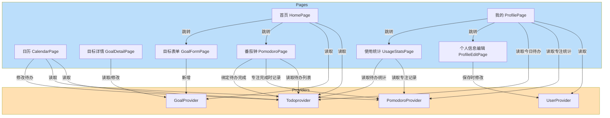

# 智能日常助手 APP —— 开发文档

## 一、项目概述

大学生专属的 **个人成长管家 + 智能陪伴助手**，基于 Flutter 3.x 构建，支持 Android / HarmonyOS。

---

## 二、页面导航架构

### 2.1 整体导航结构

```text
MaterialApp (onGenerateRoute 统一路由管理)
│
└── MainShell (Scaffold + BottomNavigationBar + IndexedStack)
    │
    ├── [Tab 0] ── 首页 (HomePage)                ← 今日看板
    │               ├── 待办完成概览（可点击切换完成状态）
    │               ├── 番茄钟快捷入口（可自定义时长）
    │               ├── 目标进度网格（自适应列数）
    │               │   └── [➕ 新增目标] 入口
    │               └── → 番茄钟详情页 (PomodoroPage)
    │               └── → 目标表单 (GoalFormPage)
    │
    ├── [Tab 1] ── 日历 (CalendarPage)            ← 事务管理
    │               ├── 月视图网格（左右滑动切换月份）
    │               ├── 有任务日期显示彩色圆点
    │               ├── 点击日期 → 下方展开当日详情
    │               │   ├── 当日待办列表（优先级颜色标记）
    │               │   ├── 当日完成率 + 专注时长
    │               │   └── [新增待办] 按钮
    │               ├── → 新增/编辑待办 (TodoFormPage)
    │               ├── → 待办详情 (TodoDetailPage)
    │               ├── → 新增/编辑目标 (GoalFormPage)
    │               └── → 目标详情 (GoalDetailPage)
    │
    ├── [Tab 2] ── 生活 (LifePage)                ← 陪伴模块
    │               ├── 顶部 TabBar 切换:
    │               │   ├── [动态] 时间线展示个人动态
    │               │   └── [AI小助手] DeepSeek对话
    │               ├── → 新增动态 (PostFormPage)  ← FAB触发
    │               ├── → 动态详情 (PostDetailPage)
    │               └── AI自动情绪识别 + 共情回复
    │
    └── [Tab 3] ── 我的 (ProfilePage)             ← 个人中心
                    ├── 用户头像 / 昵称 / 账号
                    ├── 统计数据卡片（专注次数、待办完成、生活记录）
                    ├── 个人信息设置入口（带保存按钮）
                    ├── 深色模式切换 Switch
                    ├── 通知设置
                    ├── → 使用统计独立页面 (UsageStatsPage)
                    ├── 今日成就（与待办数据联动）
                    └── 关于应用
```

### 2.2 页面跳转关系图

```text
┌──────────────────────────────────────────────────────────┐
│                   MainShell (底部导航 4 Tab)               │
│    ┌──────┐      ┌──────┐      ┌──────┐      ┌──────┐   │
│    │ 首页  │      │ 日历  │      │ 生活  │      │ 我的  │   │
│    └──┬───┘      └──┬───┘      └──┬───┘      └──┬───┘   │
└───────┼─────────────┼─────────────┼─────────────┼───────┘
        │             │             │             │
        ▼             ▼             │             ▼
   ┌────────┐   ┌──────────┐       │        ┌──────────┐
   │ 番茄钟  │   │ 待办表单  │       │        │ 个人信息  │
   │(绑定待办)│   ├──────────┤       │        │ (带保存)  │
   └────────┘   │ 待办详情  │       │        ├──────────┤
                ├──────────┤       │        │ 使用统计  │
                │ 目标表单  │       │        └──────────┘
                ├──────────┤       │
                │ 目标详情  │       ▼
                │(子目标+   │  ┌──────────┐
                │ 状态切换) │  │ 新增动态  │
                └──────────┘  ├──────────┤
                              │ 动态详情  │
                              └──────────┘

图例:  ──→  Navigator.push() 跳转
       ──→  Tab 内嵌页面
```

---

## 三、各页面详细设计

### 3.1 首页（HomePage）— 今日看板

```
┌─────────────────────────────┐
│  ☀️ 早上好，同学            │  ← 问候语 + 当前日期
│  今日待办: 已完成 3/5       │  ← 线性进度条
├─────────────────────────────┤
│  ┌─ 番茄钟 ──────────────┐  │
│  │    25:00              │  │  ← 倒计时显示
│  │  ┌──────┐  ┌────────┐ │  │
│  │  │ 开始  │  │ 自定义  │ │  │  ← 自定义时长（分钟）
│  │  └──────┘  └────────┘ │  │
│  └───────────────────────┘  │
├─────────────────────────────┤
│  📌 目标进度          [+ 新增] │  ← 新增目标入口
│  ┌──────┐  ┌──────┐       │
│  │考研  │  │四级  │       │  ← 响应式网格布局
│  │ 68%  │  │ 30%  │       │     ≤400px: 2列
│  └──────┘  └──────┘       │     401-700px: 3列
│  ┌──────┐                  │     >700px: 4列
│  │健身  │                  │
│  │ 50%  │                  │
│  └──────┘                  │
└─────────────────────────────┘
```

**交互说明：**
- 番茄钟分"快速开始"（默认25分钟）和"自定义"（底部弹窗输入分钟数）
- 待办项点击即可切换完成/未完成状态
- 目标卡片以自适应网格布局展示，响应式列数
- 新增目标按钮 → 跳转目标表单页
- 点击目标卡片 → 跳转目标详情页

---

### 3.2 日历（CalendarPage）— 月视图 + 日详情（与首页待办数据同步）

```
┌─────────────────────────────┐
│   ← 2026年5月 →            │  ← 左右箭头切换月份
│  日 一 二 三 四 五 六       │
│                   1  2  3   │
│   4  5  6  7  8  9 10      │
│  11 12 13 14 15 16 17      │
│  18 19 ● 21 22 23 24      │  ← ● 表示该日有任务
│  25 26 27 28 29 30 31      │  ← 圆点颜色按优先级
├─────────────────────────────┤
│  📋 5月20日（周三）         │  ← 点击日期展开
│  ┌─────────────────────┐   │
│  │ 🔴 复习高数第三章    │   │  ← 优先级: 红>黄>绿
│  │ 🟡 写英语作文        │   │
│  │ 🟢 运动30分钟        │   │
│  ├─────────────────────┤   │
│  │ ✅ 完成率: 33%       │   │  ← 当日统计
│  │ ⏱ 专注时长: 25分钟   │   │
│  │ [＋ 新增待办]        │   │
│  └─────────────────────┘   │
└─────────────────────────────┘
```

**交互说明：**
- 月视图左右滑动切换月份
- 点击日期 → 下方区域展开当日详情（再次点击收起）
- 待办项点击 → 跳转待办详情页
- 待办项左侧颜色条 = 优先级（红=高，黄=中，绿=低）
- [＋ 新增待办] → 跳转待办表单页
- **数据同步**：通过 TodoProvider 与首页共享同一数据源，任意一处修改待办状态，另一处自动更新
- **专注时长**：通过 PomodoroProvider 获取当日番茄钟记录总和，显示在日历日详情中

---

### 3.3 生活（LifePage）— 动态 + AI小助手

```
┌─────────────────────────────┐
│  [动态]    [AI小助手]        │  ← 顶部 TabBar 切换
│                             │
│  ── 当 Tab = 动态 ──       │
│  😊 今天图书馆学了6小时    │  ← 心情标签 + 文字
│  感觉很充实！              │
│  ─ 昨天 16:30 ─           │
│  😰 好焦虑，复习不完...     │
│  💬 AI: 别担心，按计划...   │  ← AI 自动共情回复
│  ─ 前天 10:15 ─           │
│  😢 想家了...             │
│                             │
│  ── 当 Tab = AI小助手 ──  │
│  ┌─────────────────────┐   │
│  │                     │   │
│  │   对话气泡区域       │   │
│  │                     │   │
│  └─────────────────────┘   │
│  [输入框...]  [发送]       │
│                             │
│              [＋]           │  ← FAB: 发布新动态
└─────────────────────────────┘
```

**交互说明：**
- 顶部 TabBar 在"动态"、"AI小助手"间切换
- 动态按时间倒序排列，按日期分组（今天/昨天/更早）
- 每条动态显示心情标签（😊开心 / 😐平静 / 😰焦虑 / 😫疲惫 / 😢难过）
- AI 自动识别动态中的情绪并生成共情回复
- FAB 浮动按钮 → 跳转发布动态页面
- AI小助手中支持多轮对话

---

### 3.4 我的（ProfilePage）— 个人中心

```
┌─────────────────────────────┐
│          👤                  │  ← 圆形头像（可编辑）
│        同学                  │  ← 昵称（可编辑）
│    用更好的自己迎接每一天    │
├─────────────────────────────┤
│  ┌───────────────────────┐  │
│  │  128 次  │ 89 完成  │  │  │  ← 统计数据卡片
│  │  23 记录              │  │  │    专注次数(PomodoroProvider)
│  └───────────────────────┘  │  │    待办完成(TodoProvider)
├─────────────────────────────┤
│  ┌───────────────────────┐  │
│  │ 👤 个人信息设置    >   │  │  ← 跳转个人信息编辑页（带保存按钮）
│  ├───────────────────────┤  │
│  │ 🌙 深色模式    [开关]  │  │  ← Switch 控件
│  ├───────────────────────┤  │
│  │ 🔔 通知设置        >  │  │
│  ├───────────────────────┤  │
│  │ 📊 使用统计        >  │  │  ← 跳转统计详情页
│  ├───────────────────────┤  │
│  │ ℹ️ 关于应用        >  │  │
│  └───────────────────────┘  │
├─────────────────────────────┤
│  ⭐ 今日成就                │  ← 与待办数据联动
│  ✅  📚  🔥  💪            │  ← 基于真实数据显示
└─────────────────────────────┘
```

**交互说明：**
- 顶部统计数据卡片从 Provider 实时读取：专注次数 ← PomodoroProvider，待办完成 ← TodoProvider
- 点击头像区域或"个人信息设置" → 跳转个人信息编辑页
- 个人信息编辑页改为 StatefulWidget，底部有"保存"按钮，点击后写入 UserProvider 并返回
- 深色模式开关实时切换全局主题
- "使用统计" → 跳转独立的使用统计详情页 (UsageStatsPage)
- "今日成就"区域数据与 TodoProvider 联动，显示真实今日完成待办数、连续完成天数等

---

### 3.5 目标详情（GoalDetailPage）— 目标详情 + 短期子目标

```
┌─────────────────────────────┐
│  ← 目标详情                 │
├─────────────────────────────┤
│  🎓  考研上岸       [已完成]│  ← 目标状态切换按钮
│                           │     进行中 ↔ 已完成
├─────────────────────────────┤
│  进度                       │
│  ████████████░░░░ 68%      │  ← 进度条（可编辑）
│  ⏱ 剩余 120 天             │
│  创建于 2026/01/15          │
├─────────────────────────────┤
│  短期目标                    │  ← 子目标列表
│  ┌─────────────────────┐   │
│  │ ✅ 完成高数一轮复习    │   │
│  │ 📅 截止: 2026/03/01  │   │  ← 子目标截止日期
│  ├─────────────────────┤   │
│  │ ✅ 英语单词背完一轮    │   │
│  │ 📅 截止: 2026/04/01  │   │
│  ├─────────────────────┤   │
│  │ ⭕ 专业课复习开始    │   │  ← ⭕ 未完成
│  │ 📅 截止: 2026/06/01  │   │
│  └─────────────────────┘   │
│  ┌─────────────────────┐   │
│  │ [输入新子目标...]  │   │  ← 添加子目标
│  │ 截止日期: [选择]    │   │
│  │ [➕ 添加]            │   │
│  └─────────────────────┘   │
└─────────────────────────────┘
```

**交互说明：**
- 目标状态切换：点击顶部按钮在"进行中"和"已完成"之间切换，通过 GoalProvider 同步
- 子目标列表：每个子目标可点击切换完成/未完成状态
- 添加子目标：底部输入框 + 日期选择器，带截止日期
- 数据联动：子目标完成进度自动计算主目标进度百分比

---

### 3.6 番茄钟（PomodoroPage）— 专注计时 + 待办绑定

```
┌─────────────────────────────┐
│  ← 专注模式                 │
├─────────────────────────────┤
│  ┌─ 待办绑定 ────────────┐  │
│  │ 绑定待办: [下拉菜单 ▼] │  │  ← 可选择待办任务
│  │              (可不绑定) │  │     从 TodoProvider 获取列表
│  └────────────────────────┘  │
├─────────────────────────────┤
│  ┌───────────────────────┐  │
│  │     ⌛ 保持专注        │  │
│  │                       │  │
│  │      ⏺ 25:00          │  │  ← 圆形倒计时
│  │     剩余 25 分钟      │  │
│  │                       │  │
│  │  🔄 [▶️ 开始]  ⏹     │  │  ← 🔄重置 ⏹结束
│  └───────────────────────┘  │
│  💡 专注时请保持安静环境    │
└─────────────────────────────┘
```

**交互说明：**
- **待办绑定**：顶部下拉菜单列出当日待办，选择后绑定（可选，可不选直接开始）
- **开始/暂停**：切换计时状态
- **重置**：任何时候点击重置，计时器回到初始时长（如 25:00）
- **结束**：任何时候点击结束，停止计时并记录本次专注时长到 PomodoroProvider
- **专注完成**：倒计时归零时自动完成，绑定待办时将该待办标记为已完成
- **数据记录**：每次完成的番茄钟记录包含：日期、时长、绑定的待办ID（如有）

---

## 四、全局配色方案

### 4.1 颜色定义

| 颜色名称 | 色值 | 用途说明 |
|---------|------|----------|
| 主橙色 | `#F98C53` | 主色调、强调色、按钮、重要图标、选中状态 |
| 淡绿色 | `#D2E0AA` | 辅助色、成功状态、待办完成标记 |
| 浅蓝色 | `#ABD7FB` | 辅助色、信息提示、AI 评论气泡背景 |
| 浅米白 | `#F9F2EF` | 页面背景（浅色模式） |
| 柔珊瑚 | `#FCCEB4` | 次要背景、标签背景、温和强调 |
| 白色 | `#FFFFFF` | 卡片背景、表单背景 |
| 深灰色 | `#333333` | 主要文字 |
| 浅灰色 | `#999999` | 辅助文字、提示文字 |
| 高优先级红 | `#E57373` | 高优先级待办标记 |
| 中优先级黄 | `#FFD54F` | 中优先级待办标记 |
| 低优先级绿 | `#81C784` | 低优先级待办标记 |

### 4.2 深色模式颜色

| 元素 | 推荐色值 |
|------|----------|
| 页面背景 | `#1A1A1A` |
| 卡片背景 | `#2D2D2D` |
| 主橙色（保持） | `#F98C53` |
| 淡绿色（保持） | `#D2E0AA` |
| 浅蓝色（保持） | `#ABD7FB` |
| 主要文字 | `#F0F0F0` |
| 辅助文字 | `#AAAAAA` |

---

## 五、路由表设计

使用 `onGenerateRoute` 方式管理路由，集中定义在 `routes/app_router.dart` 中：

### 5.1 路由常量

```dart
class AppRoutes {
  static const String pomodoro = '/pomodoro';
  static const String todoForm = '/todoForm';
  static const String todoDetail = '/todoDetail';
  static const String goalForm = '/goalForm';
  static const String goalDetail = '/goalDetail';
  static const String postForm = '/postForm';
  static const String postDetail = '/postDetail';
  static const String profileEdit = '/profileEdit';
  static const String usageStats = '/usageStats';   // 新增：使用统计页面
}
```

### 5.2 路由传参模型

| 路由 | 参数类型 | 说明 |
|------|---------|------|
| `/pomodoro` | `int?` | 可传入自定义时长（分钟），null 则默认25分钟 |
| `/todoForm` | `Map?` | 传入 `{'date': DateTime}` 为指定日期新增，null 为默认 |
| `/todoDetail` | `String` | 待办 ID |
| `/goalForm` | `void` | 无需参数，新增目标 |
| `/goalDetail` | `String` | 目标 ID |
| `/postForm` | `void` | 无需参数 |
| `/postDetail` | `Map` | 包含动态 ID 和内容 |
| `/profileEdit` | `void` | 无需参数 |
| `/usageStats` | `void` | 无需参数，使用统计页面 |

### 5.3 MaterialApp 配置

```dart
MaterialApp(
  initialRoute: '/',
  onGenerateRoute: AppRouter.generateRoute,
)
```

> 注：首页、日历、生活、我的 作为 Tab 内嵌页面，不占用路由名。

---

## 六、项目目录结构

```
lib/
├── main.dart                      # 入口 + MaterialApp 配置 + Provider 注册
├── routes/
│   ├── app_routes.dart            # 路由常量
│   └── app_router.dart            # onGenerateRoute 实现
├── models/
│   ├── todo.dart                  # 待办数据模型
│   ├── goal.dart                  # 目标数据模型（含 SubGoal 子目标）
│   ├── user_profile.dart          # 用户信息数据模型
│   └── pomodoro_record.dart       # 番茄钟专注记录数据模型
├── providers/
│   ├── theme_provider.dart        # 深色模式状态
│   ├── todo_provider.dart         # 待办状态（首页与日历共享）
│   ├── goal_provider.dart         # 目标状态（含子目标管理）
│   ├── user_provider.dart         # 用户信息状态
│   └── pomodoro_provider.dart     # 番茄钟专注记录（专注统计）
├── pages/
│   ├── main_shell.dart            # 底部导航容器（4 Tab）
│   ├── home/
│   │   └── home_page.dart         # 首页（待办概览+番茄钟+目标网格）
│   ├── calendar/
│   │   ├── calendar_page.dart     # 日历月视图 + 日详情展开（含专注时长）
│   │   ├── todo_form_page.dart    # 新增/编辑待办
│   │   ├── todo_detail_page.dart  # 待办详情
│   │   ├── goal_form_page.dart    # 新增/编辑目标
│   │   └── goal_detail_page.dart  # 目标详情（含短期子目标 + 状态切换）
│   ├── life/
│   │   ├── life_page.dart         # 生活（动态+AI小助手 TabBar）
│   │   ├── post_form_page.dart    # 发布动态
│   │   └── post_detail_page.dart  # 动态详情
│   ├── profile/
│   │   ├── profile_page.dart      # 我的（个人信息/统计数据/设置/成就）
│   │   ├── profile_edit_page.dart # 个人信息编辑（带保存按钮）
│   │   └── usage_stats_page.dart  # 使用统计详情页
│   └── pomodoro/
│       └── pomodoro_page.dart     # 番茄钟（含待办绑定 + 重置/结束）
└── ...
```

---

## 七、状态管理设计

### 7.1 状态管理架构

使用 `Provider` 进行全局状态管理：

```
Provider 层级结构（在 main.dart 中注册）:

MultiProvider
├── ChangeNotifierProvider<ThemeProvider>
│   └── 管理深色/浅色主题切换
├── ChangeNotifierProvider<TodoProvider>
│   └── 管理待办事项（首页 + 日历共享）
├── ChangeNotifierProvider<GoalProvider>
│   └── 管理目标进度 + 短期子目标（首页 + 日历共享）
├── ChangeNotifierProvider<UserProvider>
│   └── 管理用户个人信息（头像/昵称/账号等）
└── ChangeNotifierProvider<PomodoroProvider>
    └── 管理番茄钟专注记录（专注次数、时长统计）
```

### 7.2 数据同步策略

| 数据类型 | 提供者 | 消费页面 | 修改页面 | 同步方式 |
|---------|--------|---------|---------|---------|
| 待办事项 | TodoProvider | 首页、日历、番茄钟(绑定下拉) | 首页、日历待办表单 | context.watch 实时同步 |
| 目标进度 + 子目标 | GoalProvider | 首页、日历目标详情 | 目标表单、目标详情 | context.watch 实时同步 |
| 用户信息 | UserProvider | 我的、个人信息编辑 | 个人信息编辑(保存按钮) | context.watch 实时同步 |
| 番茄钟记录 | PomodoroProvider | 我的(统计卡片/今日成就)、日历(专注时长)、使用统计页 | 番茄钟页面(完成/结束时) | context.watch 实时同步 |

### 7.3 数据流图



说明：
- **实线箭头**表示读取/消费数据
- **虚线样式**表示跳转关系
- TP、GP、UP、PP 五个 Provider 在 main.dart 的 MultiProvider 中注册
- 所有 Provider 通过 context.watch / context.read 与页面通信

---

## 八、底部导航栏设计

使用 `IndexedStack` 保持各 Tab 页面状态，切换时不重建。

```dart
BottomNavigationBar 配置（4个Tab）:

| 索引 | 标签    | 图标 (filled/outlined)   | 页面          |
|------|---------|--------------------------|---------------|
| 0    | 首页    | Icons.home_rounded       | HomePage      |
| 1    | 日历    | Icons.calendar_month     | CalendarPage  |
| 2    | 生活    | Icons.favorite_rounded   | LifePage      |
| 3    | 我的    | Icons.person_rounded     | ProfilePage   |
```

---

## 九、开发规范

| 规范项 | 要求 |
|--------|------|
| 代码注释 | 关键逻辑添加注释说明 |
| 状态管理 | 使用 Provider |
| UI 规范 | Material Design 3，支持深色模式 |
| 命名规范 | 文件使用 snake_case，类名使用 PascalCase |
| Git 提交 | 功能完成后及时 commit，备注清晰 |

---

## 十、当前进度

- [x] 全局主题配置（浅色/深色模式）
- [x] 底部导航栏（4 Tab）
- [x] 首页布局（待办概览 + 番茄钟 + 目标网格）
- [x] 番茄钟页面（圆形进度 + 计时控制）
- [x] 日历页面（月视图 + 日详情）
- [x] 生活页面（动态时间线 + AI聊天）
- [x] 我的页面（个人信息 + 设置 + 成就）
- [ ] 数据状态管理（Provider 实现）
- [ ] 待办数据同步（首页 ↔ 日历）
- [ ] 目标管理（新增/编辑/同步）
- [ ] 个人信息编辑（头像/昵称/账号）
- [ ] 本地数据持久化

---

## 十一、扩展功能（本次迭代）

### 11.1 目标详情改造
- [ ] Goal 模型增加 description、status 字段
- [ ] 新增 SubGoal 模型（title、isCompleted、deadline）
- [ ] GoalProvider 增加子目标管理方法
- [ ] GoalDetailPage 重写：显示真实数据、状态切换按钮、子目标列表
- [ ] 添加子目标功能（输入标题 + 选择截止日期）

### 11.2 番茄钟增强
- [ ] 新增 PomodoroRecord 模型（id、date、durationMinutes、todoId、todoTitle、completedAt）
- [ ] 新增 PomodoroProvider（记录管理、今日专注时长统计、总专注次数统计）
- [ ] PomodoroPage 增加重置按钮（任何时候可重置）
- [ ] PomodoroPage 增加结束按钮（任何时候可结束并记录）
- [ ] PomodoroPage 顶部增加待办绑定下拉菜单（读取 TodoProvider）

### 11.3 数据共享与联动
- [ ] 日历页日详情显示当日专注时长（读取 PomodoroProvider）
- [ ] 我的页面顶部统计卡片显示真实数据（专注次数、待办完成数）
- [ ] 我的页面今日成就与 TodoProvider 数据联动
- [ ] 新增使用统计独立页面（UsageStatsPage）
- [ ] 个人信息编辑页改为 StatefulWidget + 保存按钮
- [ ] 在 main.dart 注册 PomodoroProvider
