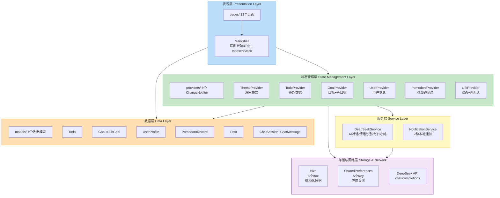
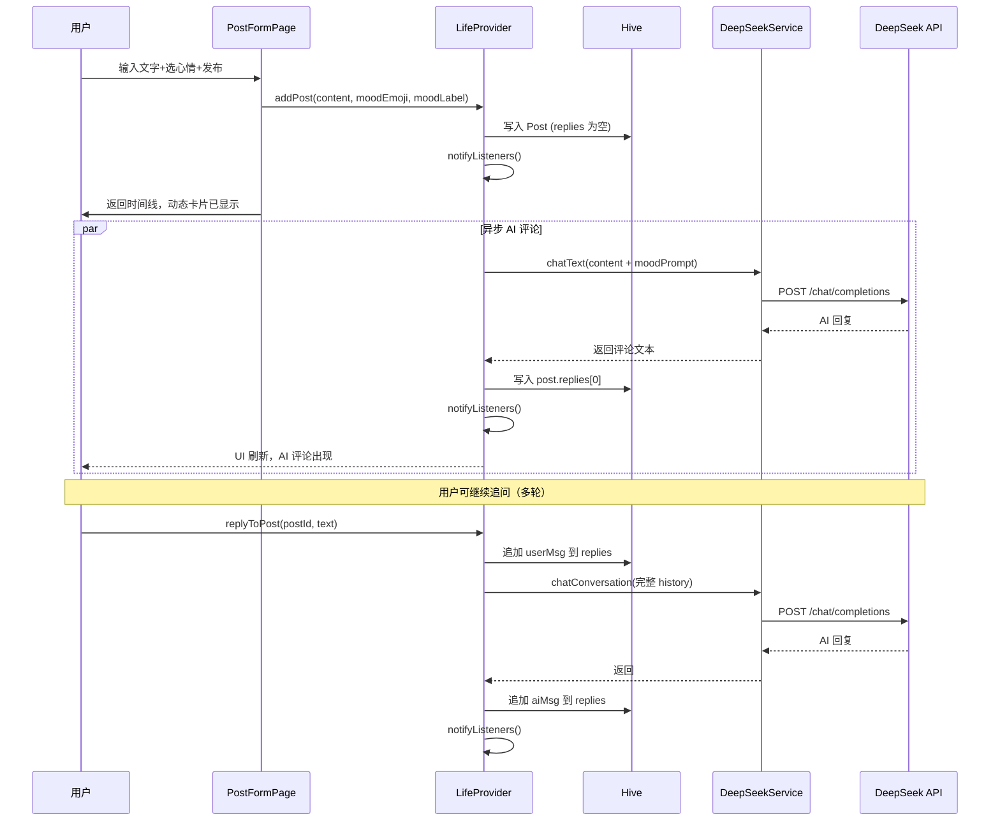
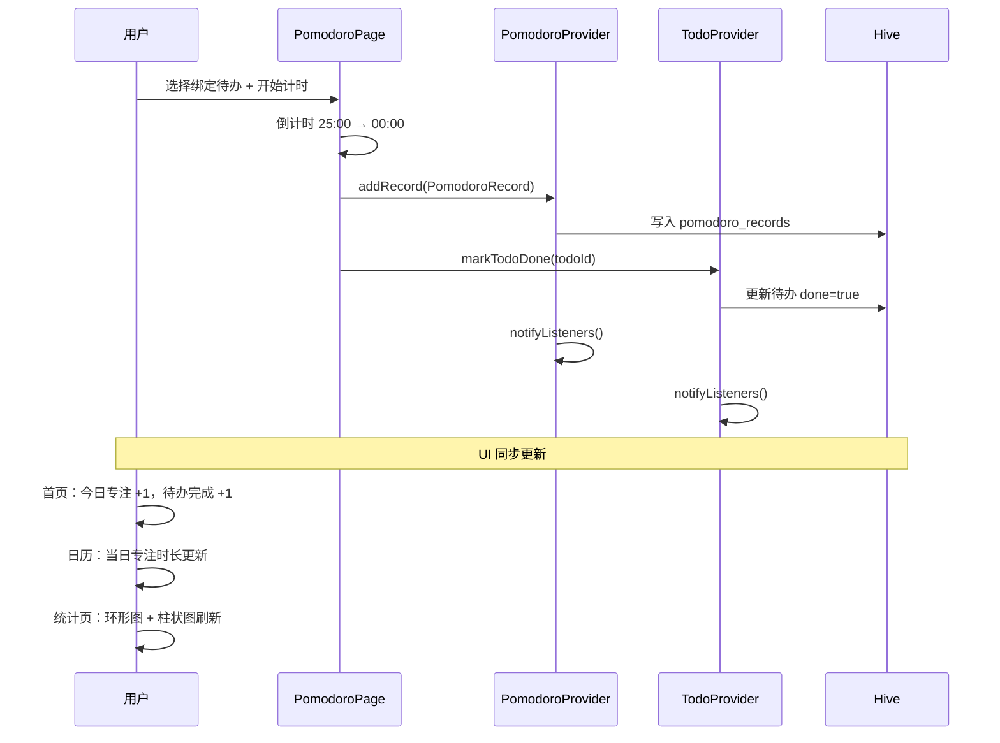

# 智能日常助手 — 技术栈文档

---

## 1. 项目概述

| 项目信息 | 内容 |
|---------|------|
| 项目定位 | 面向大学生的个人成长管家 + AI 陪伴助手，解决目标规划混乱、任务拖延、情绪内耗等问题 |
| 目标用户 | 在校大学生（面临多课程并行、考级备考、情绪压力等场景） |
| 项目状态 | 核心功能已完成 |


---

## 2. 整体架构

### 2.1 架构总览

项目采用经典分层架构，严格遵循单向依赖原则——上层依赖下层，下层不感知上层。



**调用规则（严格单向）**：

```
Page  →  Provider  →  Service  →  Hive / HTTP
  ↓        ↓           ↓
Models   Models      Models
```

- **Page** 只通过 `context.watch<T>()` / `context.read<T>()` 消费 Provider，不直接访问 Hive 或 HTTP
- **Provider** 持有内存数据，提供增删改接口，每次修改后调用 Hive 持久化 + `notifyListeners()`
- **Service** 封装 DeepSeek API 调用和通知发送
- **Model** 纯 Dart 对象，所有层共享，不依赖任何框架

### 2.2 核心业务流程

**流程一：动态发布 → AI 评论 → 多轮追问（异步非阻塞）**



**流程二：番茄钟 → 待办联动 → 数据统计**



---

## 3. 核心功能与技术实现

### 功能模块一：目标与备考规划

- **核心功能**：创建长期/短期目标，子目标拆解，进度自动计算，截止日期提醒
- **技术实现**：
  - 数据模型 `Goal` + `SubGoal`（组合关系，SubGoal 内嵌于 Goal 的 List 字段）
  - 进度公式：`progress = 已完成子目标数 / 子目标总数`，在 `GoalProvider.toggleSubGoal()` 中触发重算
  - 状态切换：`Goal.toggleGoalStatus()` 在 "进行中" ↔ "已完成" 间切换
  - 通知：子目标 deadline 前 3 天通过 `NotificationService.showSubGoalReminder()` 推送
- **关键代码位置**：
  - [models/goal.dart](file:///d:/HarmonyOS/FlutterApplication/flutter_harmonyos/lib/models/goal.dart) — Goal + SubGoal 模型
  - [providers/goal_provider.dart](file:///d:/HarmonyOS/FlutterApplication/flutter_harmonyos/lib/providers/goal_provider.dart) — 状态管理
  - [pages/calendar/goal_detail_page.dart](file:///d:/HarmonyOS/FlutterApplication/flutter_harmonyos/lib/pages/calendar/goal_detail_page.dart) — 详情与子目标 UI

### 功能模块二：待办与日历联动

- **核心功能**：待办增删改查 + 月历视图查看 + 首页与日历数据实时同步
- **技术实现**：
  - 日历使用 `PageView` + `AnimatedContainer` 实现月视图左右滑动切换
  - 日期圆点颜色按当日最高优先级确定（`priority: 3=红, 2=黄, 1=绿`）
  - `TodoProvider` 作为单一数据源，被 `HomePage`、`CalendarPage`、`PomodoroPage` 三个页面共享订阅
  - 使用 `context.watch<TodoProvider>()` 保证一页修改另一页即时刷新
  - 数据结构中 `date` 字段使按日期筛选成为纯内存操作（`where()` 过滤器）
- **关键代码位置**：
  - [models/todo.dart](file:///d:/HarmonyOS/FlutterApplication/flutter_harmonyos/lib/models/todo.dart) — Todo 模型
  - [providers/todo_provider.dart](file:///d:/HarmonyOS/FlutterApplication/flutter_harmonyos/lib/providers/todo_provider.dart) — 状态管理
  - [pages/calendar/calendar_page.dart](file:///d:/HarmonyOS/FlutterApplication/flutter_harmonyos/lib/pages/calendar/calendar_page.dart) — 月视图 + 日详情

### 功能模块三：番茄钟计时

- **核心功能**：倒计时专注、待办绑定、完成后自动标记待办完成、专注记录统计
- **技术实现**：
  - 使用 Flutter `Timer.periodic(Duration(seconds: 1))` 实现倒计时
  - 圆形进度条用 `CircularProgressIndicator(value: progress)` 配合自定义 `CustomPainter`
  - 待办绑定通过 `DropdownButton` 从 `TodoProvider` 获取当日未完成待办列表
  - 计时结束时调用 `PomodoroProvider.addRecord()` + `TodoProvider.markTodoDone()` 双写
  - 数据冗余设计：`PomodoroRecord` 同时存储 `todoId` 和 `todoTitle`，避免统计查询跨模型检索
  - 首页快捷入口支持自定义分钟数（通过底部弹窗 `showModalBottomSheet` 输入，范围 1-120）
- **关键代码位置**：
  - [models/pomodoro_record.dart](file:///d:/HarmonyOS/FlutterApplication/flutter_harmonyos/lib/models/pomodoro_record.dart) — 记录模型
  - [providers/pomodoro_provider.dart](file:///d:/HarmonyOS/FlutterApplication/flutter_harmonyos/lib/providers/pomodoro_provider.dart) — 状态管理
  - [pages/pomodoro/pomodoro_page.dart](file:///d:/HarmonyOS/FlutterApplication/flutter_harmonyos/lib/pages/pomodoro/pomodoro_page.dart) — 计时 UI

### 功能模块四：私密生活圈 + AI 对话

- **核心功能**：发布图文动态（5 种心情标签）、AI 自动生成共情评论、多轮追问、独立 AI 聊天
- **技术实现**：
  - 图片处理：`image_picker` 选取 → `maxWidth: 512, maxHeight: 512` 裁剪 → `base64Encode` 编码存储（约 10-20KB）
  - AI 评论采用「先写后补」模式：发布时先写入 Hive → 立即显示动态卡片 → 异步调 DeepSeek → 返回后回写 `post.replies[0]` → 二次 `notifyListeners()` 刷新 UI
  - 多轮对话上下文窗口取最近 40 条消息（约 20 轮），通过 `chatConversation()` 传入完整 history
  - 情绪识别使用本地规则引擎 `detectEmotion()` 关键字匹配（焦虑/疲惫/开心/难过/平静），零延迟、零网络开销
  - DeepSeek API Key 通过 `--dart-define=DEEPSEEK_API_KEY=xxx` 编译参数传入，未配置时所有 AI 调用自动降级返回预设文案
  - 帖子中 `imageBase64` 仅用于卡片预览，不参与 AI 生成内容（纯文字对话模式）
- **关键代码位置**：
  - [models/post.dart](file:///d:/HarmonyOS/FlutterApplication/flutter_harmonyos/lib/models/post.dart) — 动态模型（含 `replies: List<ChatMessage>`）
  - [models/chat_session.dart](file:///d:/HarmonyOS/FlutterApplication/flutter_harmonyos/lib/models/chat_session.dart) — 对话会话 + ChatMessage
  - [providers/life_provider.dart](file:///d:/HarmonyOS/FlutterApplication/flutter_harmonyos/lib/providers/life_provider.dart) — 动态 + 对话状态管理
  - [services/deepseek_service.dart](file:///d:/HarmonyOS/FlutterApplication/flutter_harmonyos/lib/services/deepseek_service.dart) — API 封装
  - [pages/life/life_page.dart](file:///d:/HarmonyOS/FlutterApplication/flutter_harmonyos/lib/pages/life/life_page.dart) — TabBar 切换动态/AI聊天

### 功能模块五：数据统计

- **核心功能**：本周待办完成率、专注总时长、近 7 天趋势柱状图、环形成就图
- **技术实现**：
  - 所有统计指标从 Provider 内存数据中实时计算（`PomodoroProvider.todayMinutes`、`TodoProvider.getCompletedCount()` 等 getter）
  - 近 7 天趋势：`PomodoroProvider` 提供 `getMinutesPerDay(days)` 方法，返回 `Map<String, int>`，柱状图通过 `Container` + 动态高度实现
  - 环形成就图：使用 `CustomPainter` 绘制扇形弧度（`canvas.drawArc`），数据源来自 `TodoProvider` 本周完成率
  - 无额外持久化——统计是已有数据的聚合视图，数据和操作数据同源
- **关键代码位置**：
  - [pages/profile/usage_stats_page.dart](file:///d:/HarmonyOS/FlutterApplication/flutter_harmonyos/lib/pages/profile/usage_stats_page.dart) — 统计看板
  - [pages/profile/profile_page.dart](file:///d:/HarmonyOS/FlutterApplication/flutter_harmonyos/lib/pages/profile/profile_page.dart) — 首页统计卡片

### 功能模块六：用户设置与深色模式

- **核心功能**：个人信息编辑、头像更换、深色模式切换、通知偏好管理
- **技术实现**：
  - `ThemeProvider` 持有 `ThemeMode`，通过 `SharedPreferences` 持久化 `theme_mode` 布尔值
  - `MaterialApp.themeMode` 直接绑定 `ThemeProvider.themeMode`，Switch 切换后全局即时生效
  - 浅色/深色两套完整 `ColorScheme` 在 `main.dart` 的 `_buildLightTheme()` / `_buildDarkTheme()` 中定义（各包含 16 个色值）
  - 5 个设置项分别对应 5 个 `SharedPreferences` Key，各 `NotificationService` 方法调用前先通过 `_isEnabled(key)` 检查开关
  - 头像使用 Base64 字符串存储在 `UserProfile.avatarBase64` 中，渲染用 `Image.memory(base64Decode(...))`
- **关键代码位置**：
  - [providers/theme_provider.dart](file:///d:/HarmonyOS/FlutterApplication/flutter_harmonyos/lib/providers/theme_provider.dart) — 主题状态
  - [providers/user_provider.dart](file:///d:/HarmonyOS/FlutterApplication/flutter_harmonyos/lib/providers/user_provider.dart) — 用户信息
  - [lib/main.dart](file:///d:/HarmonyOS/FlutterApplication/flutter_harmonyos/lib/main.dart) L67-199 — 主题 ColorScheme 定义

---

## 4. 详细技术栈

| 技术类别 | 技术名称 | 版本号 | 主要作用 | 选型理由 | 替代方案 |
|---------|---------|--------|---------|---------|---------|
| 开发语言 | Dart | 3.6.2 | 应用开发主语言 | 强类型、AOT编译、支持JIT热重载、原生性能 | Kotlin / Swift |
| UI 框架 | Flutter | 3.x | 跨平台 UI 框架 | 单一代码库支持 Android + HarmonyOS、自绘引擎性能接近原生 | React Native / uni-app |
| 状态管理 | Provider | 6.1.5+1 | 全局状态管理 | Flutter 官方推荐、API 简洁（ChangeNotifier + context.watch）、学习曲线低、适合中小型项目 | Riverpod / Bloc / GetX |
| 本地存储 | Hive | 2.2.3 | 键值对本地数据库（6个Box） | 纯 Dart 无原生依赖、零 SQL 迁移成本、读写一行代码、<1000条数据性能远超 SQLite | sqflite / ObjectBox |
| 本地存储（设置） | SharedPreferences | 2.5.3 | 键值对应用设置（5个Key） | Android/iOS 原生轻量存储、适合零散布尔/整数设置项 | Hive / 文件存储 |
| HTTP 客户端 | http | 1.6.0 | DeepSeek API 调用 | Dart 官方包、API 简洁、无需额外依赖 | Dio / retrofit |
| 本地通知 | flutter_local_notifications | 18.0.1 | 7种本地通知推送 | 社区最活跃通知插件、支持定时通知(zoneSchedule)、Android通知渠道 | awesome_notifications |
| 时区处理 | timezone | 0.10.1 | 通知定时调度时区转换 | flutter_local_notifications 的配套依赖，处理跨时区定时任务 | — |
| 日期格式化 | intl | 0.19.0 | 日历显示、日期格式化(zh_CN) | Dart 官方国际化包、支持 150+ locale、日期/数字格式化 | date_format |
| 图片选取 | image_picker | 1.2.0 | 拍照/相册选图、裁剪 | Flutter 官方插件、跨平台 API 统一、支持 maxWidth/maxHeight 约束 | wechat_assets_picker |
| 文件路径 | path_provider | 2.1.5 | 获取应用文档目录 | Flutter 官方包、跨平台路径统一、Hive 初始化必需 | — |
| 代码规范 | flutter_lints | 5.0.0 | 静态分析 Lint 规则 | Flutter 官方推荐 Lint 集、覆盖常见代码质量问题 | lint / pedantic |
| 应用图标 | flutter_launcher_icons | 0.14.4 | 自动生成 Android 启动图标 | 配置化自动生成，避免手动管理多分辨率 | 手动替换 |
| 测试框架 | flutter_test | SDK | Widget/单元测试 | Flutter SDK 内置、WidgetTester 支持组件级测试 | — |
| AI 服务 | DeepSeek Chat API | — | AI 对话生成、情绪识别、每日小结 | 国产大模型、性价比高、API 兼容 OpenAI 格式、支持中文对话质量好 | OpenAI GPT / 通义千问 |

---

## 5. 项目结构

```
flutter_harmonyos/
├── lib/                                     # Dart 源码
│   ├── main.dart                            # 应用入口：Hive初始化→Provider注册→主题配置→runApp
│   ├── models/                              # 数据模型层（纯 Dart，含序列化/反序列化）
│   │   ├── todo.dart                        # 待办事项：id/title/priority/done/date/time
│   │   ├── goal.dart                        # 目标(含SubGoal子目标)：progress自动计算
│   │   ├── user_profile.dart                # 用户信息：昵称/账号/签名/头像Base64
│   │   ├── pomodoro_record.dart             # 番茄钟记录：日期/时长/绑定待办ID
│   │   ├── post.dart                        # 生活动态：文字+心情+图片Base64+replies线程
│   │   └── chat_session.dart                # AI对话会话：含ChatMessage内嵌列表
│   ├── providers/                           # 状态管理层（ChangeNotifier，6个Provider）
│   │   ├── theme_provider.dart              # 主题模式 + SharedPreferences持久化
│   │   ├── todo_provider.dart               # 待办CRUD + Hive持久化 + Mock降级
│   │   ├── goal_provider.dart               # 目标+子目标管理 + 进度自动计算
│   │   ├── user_provider.dart               # 用户信息读写 + Hive持久化
│   │   ├── pomodoro_provider.dart           # 番茄钟记录 + 多维度统计查询
│   │   └── life_provider.dart               # 动态发布+AI评论+多轮对话管理
│   ├── services/                            # 服务层（外部接口封装）
│   │   ├── deepseek_service.dart            # DeepSeek API：文本对话/多轮对话/每日小结/情绪识别
│   │   └── notification_service.dart        # 7种本地通知：待办/目标/小结/专注/鼓励/评论就绪/使用提醒
│   ├── routes/                              # 路由管理层
│   │   ├── app_routes.dart                  # 10条路由常量定义
│   │   └── app_router.dart                  # onGenerateRoute实现（参数传递+页面映射）
│   └── pages/                               # 表现层（13个页面，4个功能域）
│       ├── main_shell.dart                  # 根容器：IndexedStack + NavigationBar(4Tab)
│       ├── home/home_page.dart              # 首页看板：问候语/待办概览/番茄钟入口/目标网格
│       ├── calendar/                        # 日历功能域（5个页面）
│       │   ├── calendar_page.dart           # 月视图+日详情（PageView月份切换）
│       │   ├── todo_form_page.dart          # 新增/编辑待办表单
│       │   ├── todo_detail_page.dart        # 待办详情查看
│       │   ├── goal_form_page.dart          # 新增/编辑目标准备
│       │   └── goal_detail_page.dart        # 目标详情+子目标管理+状态切换
│       ├── life/                            # 生活功能域（3个页面）
│       │   ├── life_page.dart               # 动态时间线+AI聊天（TabBar切换）
│       │   ├── post_form_page.dart          # 发布动态：文字+图片+心情选择
│       │   └── post_detail_page.dart        # 动态详情+AI多轮追问
│       ├── profile/                         # 个人中心（4个页面）
│       │   ├── profile_page.dart            # 统计卡片+设置列表+今日成就
│       │   ├── profile_edit_page.dart       # 个人信息编辑（含保存按钮）
│       │   ├── notification_settings_page.dart # 通知开关管理
│       │   └── usage_stats_page.dart        # 数据统计：环形图+柱状图
│       └── pomodoro/pomodoro_page.dart      # 番茄钟：待办绑定+倒计时+重置/结束
├── assets/icon/app_icon.png                 # 应用图标（flutter_launcher_icons源文件）
├── android/                                 # Android 原生工程
├── ohos/                                    # HarmonyOS NEXT 适配工程（ArkTS+ETS）
├── test/widget_test.dart                    # 基础 Widget 测试
├── pubspec.yaml                             # 依赖声明（SDK版本+11个直接依赖）
├── pubspec.lock                             # 依赖锁定（精确版本+哈希校验）
└── analysis_options.yaml                    # Dart 静态分析规则配置

外圈项目文档（d:\HarmonyOS\FlutterApplication\）：
├── README.md                                # 项目介绍+快速开始+开发指南
├── 功能文档.md                               # 功能设计：业务规则/流程/验收标准（44条）
├── 开发文档.md                               # UI设计：页面布局/交互说明/导航架构
└── 技术栈文档.md                             # 本文档：架构/技术选型/模块实现
```

**关键目录职责总结**：

| 目录 | 职责 | 依赖方向 |
|------|------|---------|
| `models/` | 纯 Dart 数据对象，含序列化 | 无依赖 |
| `services/` | 封装外调（HTTP API、通知） | → models |
| `providers/` | 持有应用状态，暴露读写接口 | → models + services |
| `pages/` | UI 渲染与用户交互 | → providers（仅通过 context.watch/read） |
| `routes/` | 集中路由管理与参数传递 | → pages |

---

## 6. 依赖管理

### 6.1 依赖管理工具

- **Pub**（Dart 官方包管理器），配置文件 `pubspec.yaml`
- 配置源：`https://pub.flutter-io.cn`（国内镜像，加速下载）

### 6.2 版本约束策略

使用 **Caret 语法（`^`）**——允许不破坏 API 兼容性的次版本和补丁版本自动升级：

```yaml
provider: ^6.1.2      # 6.1.2 ≤ version < 7.0.0
hive: ^2.2.3           # 2.2.3 ≤ version < 3.0.0
http: ^1.2.2           # 1.2.2 ≤ version < 2.0.0
```

实际锁定版本记录在 `pubspec.lock` 中，确保团队构建一致性。

### 6.3 直接依赖列表（11 个生产依赖 + 3 个开发依赖）

**生产依赖（dependencies）**：

| 包名 | 声明版本 | 锁定版本 | 类型 |
|------|---------|---------|------|
| flutter | SDK | SDK | UI 框架 |
| cupertino_icons | ^1.0.8 | 1.0.8 | iOS 风格图标 |
| provider | ^6.1.2 | 6.1.5+1 | 状态管理 |
| hive | ^2.2.3 | 2.2.3 | 本地数据库核心 |
| hive_flutter | ^1.1.0 | 1.1.0 | Hive Flutter 适配 |
| intl | ^0.19.0 | 0.19.0 | 日期/数字国际化 |
| http | ^1.2.2 | 1.6.0 | HTTP 客户端 |
| image_picker | ^1.1.2 | 1.2.0 | 图片选取 |
| shared_preferences | ^2.3.4 | 2.5.3 | 键值对设置 |
| path_provider | ^2.1.5 | 2.1.5 | 文件路径 |
| flutter_local_notifications | ^18.0.1 | 18.0.1 | 本地通知 |
| timezone | ^0.10.1 | 0.10.1 | 时区数据库 |

**开发依赖（dev_dependencies）**：

| 包名 | 声明版本 | 锁定版本 | 类型 |
|------|---------|---------|------|
| flutter_test | SDK | SDK | 测试框架 |
| flutter_lints | ^5.0.0 | 5.0.0 | Lint 规则集 |
| flutter_launcher_icons | ^0.14.1 | 0.14.4 | 应用图标生成 |

### 6.4 传递依赖概览

共约 60+ 个传递依赖（如 `archive`、`crypto`、`json_annotation`、`typed_data` 等），由上述直接依赖自动引入，无需手动管理。

---

## 7. 开发与部署

### 7.1 开发环境

| 要求项 | 规格 |
|--------|------|
| 操作系统 | Windows 10+ / macOS 12+ / Linux（推荐 Ubuntu 22.04+） |
| Flutter SDK | 3.x（Dart SDK 3.6.2） |
| 开发工具 | Android Studio Ladybug+ 或 VS Code + Flutter 扩展 |
| Android SDK | API 21+（Android 5.0） |
| HarmonyOS | DevEco Studio + HarmonyOS NEXT SDK（适配开发） |
| 命令行工具 | Git、Gradle 8.x（Android）、hvigor（HarmonyOS） |

**环境变量配置**（仅 HarmonyOS 适配需要）：
- `HOS_SDK_HOME` — HarmonyOS SDK 路径
- `OHOS_SDK` — OpenHarmony SDK 路径

### 7.2 构建与打包

| 操作 | 命令 | 产物路径 |
|------|------|---------|
| 安装依赖 | `flutter pub get` | — |
| 静态分析 | `flutter analyze` | 控制台输出（保持 0 错误） |
| Debug 运行 | `flutter run` | 设备上热重载运行 |
| Android APK（Release） | `flutter build apk --release --dart-define=DEEPSEEK_API_KEY=xxx` | `build/app/outputs/flutter-apk/app-release.apk` |
| Android App Bundle | `flutter build appbundle` | `build/app/outputs/bundle/release/app-release.aab` |
| HarmonyOS HAP | `flutter build hap --release --dart-define=DEEPSEEK_API_KEY=xxx` | `build/ohos/hap/entry-default-signed.hap` |
| 清理缓存 | `flutter clean` | — |

> **注意**：HarmonyOS 构建（`flutter build hap`）当前存在 hvigor 构建失败问题（详见 `flutter_01.log`），需进一步排查 hvigor 配置与 Flutter 工具链兼容性。

### 7.3 部署流程

**测试部署**：
1. `flutter build apk --debug` 生成 Debug APK
2. 通过 USB 或模拟器安装测试
3. 无需签名，`flutter run` 自动处理

**生产部署**：
1. 生成签名密钥：`keytool -genkey -v -keystore upload-keystore.jks -alias upload`
2. 创建 `android/key.properties` 配置签名信息
3. `flutter build apk --release` 生成已签名 Release APK
4. 分发 APK 或上传应用商店

**CI/CD**：当前未配置自动化流水线。推荐后续引入 GitHub Actions：
- 触发条件：`push` 到 `main` 分支
- 步骤：`flutter pub get` → `flutter analyze` → `flutter test` → `flutter build apk`
- 产物：自动上传 APK 到 Release Artifacts

---

## 8. 技术风险与注意事项

### 已知技术债务

| 风险项 | 严重程度 | 详情 | 影响范围 |
|--------|---------|------|---------|
| **HarmonyOS 构建失败** | 高 | `flutter build hap` 在 hvigor 阶段报错退出（exit code 1），hvigor 与 Flutter tools 工具链存在兼容问题 | 无法生成 HarmonyOS 安装包 |
| **Provider 内直接操作 Hive** | 中 | 当前 Provider 层直接调用 `Hive.box().put()`，未通过独立 Service 类封装。短期可接受但不利于单元测试 | 6 个 Provider 类 |
| **Mock 数据硬编码** | 低 | `_initMockData()` 方法中数据写死在代码中，而非从配置文件加载 | 首次启动用户体验 |
| **通知定时调度未完整实现** | 中 | `NotificationService.scheduleDailySummary()` 已实现但未在 App 启动时注册定时任务 | 每日小结通知暂无自动触发 |
| **图片存储使用 Base64** | 中 | 当前 Post 模型用 `imageBase64` 存图片，随数据量增长 Hive 读写性能可能下降 | LifeProvider / Post |
| **DeepSeek API Key 硬编码风险** | 低 | 通过 `--dart-define` 传入但默认值为空字符串，未设置时无友好提示 | AI 对话功能 |

### 潜在性能瓶颈

1. **Hive 全量读写**：当前所有 Box 使用 `data` 单 Key 存储全量 JSON 列表，每次修改全量序列化写入。在数据量 < 500 条时可接受，超过后建议改为逐条存储（`box.put(id, item)`）
2. **Base64 图片渲染**：`Image.memory(base64Decode(...))` 每次 build 都需解码，大图片可能引起列表滚动卡顿。建议缓存 `ui.Image` 或降为缩略图大小（当前已限制 512×512 裁剪）
3. **列表排序**：`LifeProvider.posts` getter 每次访问都执行 `sort()`，频繁 `notifyListeners()` 可能产生重复排序。建议排序逻辑移到数据变更时而非读取时

### 需要特别注意的技术点

1. **Provider 不跨层调用**：Provider 之间除 `PomodoroPage` 中番茄钟完成时同时调 `PomodoroProvider` + `TodoProvider` 外，其余 Provider 保持独立，不互相引用
2. **Hive Box 打开顺序**：必须在 `WidgetsFlutterBinding.ensureInitialized()` 之后、`runApp()` 之前完成 6 个 Box 的 `openBox()`，否则 Provider 构造时读取会抛出异常
3. **API Key 安全**：不允许将 API Key 提交到 Git 仓库，使用 `--dart-define` 编译时注入
4. **HomePage** 在 `MainShell` 中使用 `IndexedStack` 保持状态，不随 Tab 切换重建。但每个 Tab 首次进入时才初始化（Flutter 懒加载策略）

### 第三方依赖风险

| 依赖 | 风险 | 缓解措施 |
|------|------|---------|
| flutter_local_notifications 18.x | Android 14+ 需要 `POST_NOTIFICATIONS` 运行时权限 | 已在 `AndroidManifest.xml` 声明 |
| image_picker 1.x | Android 13+ 需要 Granular Media Permissions | 使用 `image_picker` 内部已处理权限请求 |
| DeepSeek API | 服务可用性依赖第三方、API 可能变更 | 所有调用均有降级文案、不阻塞主流程 |
| Hive 2.x | 作者已归档项目，不再维护（转向 Isar） | 当前版本稳定，本项目数据量小不受影响 |

---

