# 数据流图

## 图例

- `-->|读取|` 表示页面从 Provider 读取/消费数据
- `-->|修改|` 表示页面修改 Provider 中的数据
- `-->|跳转|` 表示页面间的路由跳转

## Mermaid 代码

```mermaid
graph TD
    subgraph Providers
        TP[TodoProvider]
        GP[GoalProvider]
        UP[UserProvider]
        PP[PomodoroProvider]
        THP[ThemeProvider]
    end

    subgraph Pages
        HP[首页 HomePage]
        CP[日历 CalendarPage]
        TFP[待办表单 TodoFormPage]
        GDP[目标详情 GoalDetailPage]
        GFP[目标表单 GoalFormPage]
        PDP[番茄钟 PomodoroPage]
        PEP[个人信息编辑 ProfileEditPage]
        PPAGE[我的 ProfilePage]
        USP[专注统计 UsageStatsPage]
    end

    HP -->|读取今日待办列表 + 完成率| TP
    HP -->|点击待办切换完成状态| TP
    HP -->|读取目标网格| GP
    HP -->|读取用户昵称用于打招呼| UP
    HP -->|跳转| PDP
    HP -->|跳转| GFP

    CP -->|按日期筛选读取待办| TP
    CP -->|点击待办切换完成状态| TP
    CP -->|读取当日专注时长| PP
    CP -->|跳转| TFP

    TFP -->|新增待办写入| TP

    PDP -->|下拉菜单读取待办列表| TP
    PDP -->|专注完成时写入记录| PP
    PDP -->|若绑定待办则标记完成| TP

    GDP -->|读取/修改目标详情| GP
    GDP -->|增删改子目标| GP
    GDP -->|切换目标完成状态| GP

    GFP -->|新增目标写入| GP

    PPAGE -->|读取昵称/签名| UP
    PPAGE -->|读取总专注次数| PP
    PPAGE -->|读取今日完成数/待办数| TP
    PPAGE -->|修改主题模式| THP
    PPAGE -->|跳转| PEP
    PPAGE -->|跳转| USP

    PEP -->|保存按钮写入昵称/账号/签名| UP

    USP -->|读取总次数/总时长/平均时长| PP
    USP -->|读取近7日趋势| PP
    USP -->|读取今日完成数/待办数| TP
    USP -->|环形图完成占比| TP

    THP -.->|全局主题切换| HP
    THP -.->|全局主题切换| CP
    THP -.->|全局主题切换| PPAGE
    THP -.->|全局主题切换| ALL[所有页面]
```

## 文字说明

### ThemeProvider
- **修改者**：我的页面（深色模式 Switch）
- **消费者**：全局所有页面（MaterialApp themeMode 驱动）

### TodoProvider
- **修改者**：首页（点击待办切换完成状态）、日历页（点击待办切换完成状态）、待办表单页（新增待办）、番茄钟页（专注完成时若绑定待办则自动标记完成）
- **消费者**：首页（今日待办列表 + 完成率进度条）、日历页（按日期筛选待办列表）、番茄钟页（下拉菜单供用户选择绑定）、我的页面（今日完成数 / 今日待办数统计卡片）、专注统计页（环形图完成占比 + 今日待办统计）

### GoalProvider
- **修改者**：目标表单页（新增目标）、目标详情页（编辑标题/描述/截止日期、切换进行中/已完成状态、子目标的增删改和完成状态切换）
- **消费者**：首页（目标进度网格卡片）、目标详情页（读取并展示单项目标详情 + 子目标列表）

### UserProvider
- **修改者**：个人设置页（保存按钮写入昵称/账号/签名）
- **消费者**：我的页面（展示头像/昵称/签名）、首页（打招呼区域显示昵称）

### PomodoroProvider
- **修改者**：番茄钟页（专注完成时或提前结束时写入专注记录）
- **消费者**：日历页（当日专注时长）、我的页面（总专注次数统计卡片）、专注统计页（总次数/总时长/平均时长 + 近7日趋势柱状图）

## 设计要点

1. **五个 Provider 在 main.dart 的 MultiProvider 中一次性注册**，确保任何页面都能通过 context.watch / context.read 访问到任意 Provider
2. **TodoProvider 与 PomodoroProvider 通过 todoId 关联**，番茄钟记录可以绑定到具体待办，用于统计每个任务的耗时占比
3. **Goal 内嵌 List\<SubGoal\>**，子目标的生命周期完全依赖于父目标，子目标完成数自动决定父目标进度百分比
4. **Provider 拆分原则**：每个 Provider 管理单一类型数据，待办变化不会触发与目标相关的页面重建
